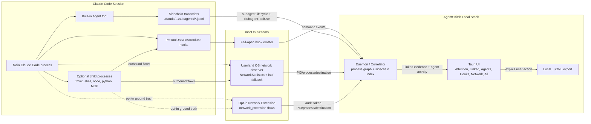

# AgentSnitch

> **Local, explainable evidence for AI coding-agent network activity.**

AgentSnitch gives developers local visibility when AI coding agents cross from sensitive local context into outbound network activity.

It is **not** DLP, not an enterprise telemetry platform, and not a blocker. The product promise is narrower and more defensible:

> AgentSnitch gives developers local, explainable evidence when AI coding agents cross from sensitive local context into outbound network activity.

## What It Does

AgentSnitch joins three local signals:

1. **Semantic truth from hooks** - Claude Code hooks tell AgentSnitch what the agent is doing: file reads, shell commands, MCP tool use, and credential-looking output.
2. **Network truth from macOS** - by default, the user daemon uses unprivileged OS process/network snapshots for agent-like process trees. The macOS Network Extension is an opt-in sensor for stronger PID/audit-token attribution.
3. **Explainable correlation** - the daemon links those streams into evidence such as: "Claude Code used an MCP tool, then the same process tree opened an outbound connection within 10 seconds."

All runtime product data must come from real agent hooks, real OS observations, and daemon-side correlation. The product UI does not seed demo cards or fabricated runtime events.

## Current Status

The current macOS MVP path is working locally:

- Claude Code `PreToolUse` and `PostToolUse` hooks emit real semantic events through a fail-open Go emitter.
- Semantic egress tools are first-class: Bash network commands, MCP tools, WebFetch, and WebSearch are treated as linkable network intent. WebFetch URLs and obvious WebSearch provider queries such as GitHub are preserved as `destination_intents` so linked cards can show the intended host alongside the OS-observed endpoint.
- A signed/notarized Tauri app includes the macOS System Extension, but the Network Sensor is disabled by default and exposed only as an advanced, experimental Settings toggle.
- The daemon enables semantic hooks plus unprivileged NetworkStatistics/`nettop` process-network correlation by default; opt-in Network Extension events use observer `network_extension`.
- `lsof` remains an unprivileged fallback observer. The fallback is polling-based, with hook-triggered burst polling to reduce aliasing around tool execution, but it can still miss short-lived connect/send/exit flows.
- The Network Sensor installs a macOS system network extension and content filter. Leave it off unless you explicitly need event-driven flow coverage; disable it immediately if you experience any connectivity issues.
- The daemon tracks process trees, correlates hooks to OS-observed flows, and forwards linked evidence to the UI. Correlation works in both directions: a new flow can link to a recent tool call, and a later `PostToolUse` event can link to a flow that was already active.
- The UI defaults to an `Attention` view and keeps `Linked`, `Agents`, `Hooks`, `Network`, and `All` available. Linked cards show human-readable WHY text, observed decision state, risk, destination category, destination snippets, replay-style explanations, and raw details collapsed behind explicit controls.
- Tabs are intentionally separated: `Network` is raw observed flow visibility, `Linked` is derived semantic-plus-network evidence, and `All` includes both.
- The `Attention` view prioritizes a compact agent context plus `Activity by agent`, then the chronological event rows; compact reason filters appear only when there are multiple useful reasons or an active reason/agent filter to clear.
- Known low-risk linked service traffic is collapsed by category in the linked feed with expand, quiet-category, and export controls.
- A compact session summary counts known Claude/bridge traffic, telemetry, package traffic, high-signal cards, and new destinations without forcing the user into raw event rows.
- Claude Code subagents are shown as a compact `Main (N)` hierarchy beside per-agent activity in evidence tabs, with a dedicated `Agents` tab for the full main-to-child breakdown. Built-in Claude Code subagents are recovered from sidechain transcripts when no separate `claude` process exists, and sidechain tool-use rows are surfaced as subagent activity.
- The window auto-resizes from the live layout: compact when quiet, wider/taller when team cards, lanes, or event volume would otherwise crowd the view.
- The UI is session-aware: after agent activity goes idle and no CLI agent process is still running, it automatically returns to the empty idle state instead of showing a stale active session.
- Session export writes schema-tagged JSONL with a session header, session summary, and evidence fields useful for debugging and harnesses.
- The installed daemon keeps the unprivileged NetworkStatistics/`nettop` observer enabled by default and keeps `lsof` available as fallback. The Network Extension is opt-in for users who want stronger ground-truth attribution.

Recent verified evidence included a Claude Code MCP hook linked to an OS-observed flow from the Claude Code process tree with reasons such as `within_10s` and `parent_match`.

## System Overview



## Components

- **Hook Emitter** (`cmd/emitter`): Small Go binary installed into Claude Code hook settings. It normalizes hook payloads, tags high-signal semantics, sends JSON to the daemon socket with a short timeout, logs locally on failure, and always returns Claude's expected proceed response.
- **Destination intent extraction** (`internal/destinationintent`): Semantic tool inputs are scanned for host-level intent before network proof exists. This does not replace DNS or OS observation; it lets linked evidence show, for example, `github.com (140.82.112.4:443)` when WebSearch/WebFetch implies GitHub and the OS observer proves the connection.
- **Hook Installer / Doctor** (`cmd/hookctl`, `cmd/doctor`): Installs/verifies Claude hooks and reports emitter, daemon socket, UI listener, hook freshness, network observer freshness, and linked-evidence freshness.
- **Network Extension** (`extension/`): Optional macOS `NEFilterDataProvider` System Extension. It is disabled by default, metadata-only, and fail-open. It always returns `.allow()` synchronously and never sits in the byte path; flow events are delivered to the daemon off the flow-decision path on a bounded background queue, so a slow or wedged daemon cannot stall network traffic. Disabling it from Settings or running `make uninstall` tears the filter down, and the OS-level controls (System Settings → Network → Filters, Safe Mode) can always remove it independently of AgentSnitch.
- **Daemon / Correlator** (`cmd/daemon`, `internal/correlator`): Receives semantic and network events, maintains a short-lived process graph, polls unprivileged OS network/process snapshots for agent-like process trees, indexes Claude Code sidechain transcripts for sub-agent attribution and activity, records transcripts, updates status, and emits conservative linked evidence.
- **Tauri UI** (`ui/`): macOS app with tray/window UI and evidence-first tabs. It shows raw hooks, sampled agent-relevant network rows, linked evidence, compact subagent context, and per-agent activity.

## Build And Run

```sh
make build
make create
./bin/doctor
```

See [docs/getting-started.md](./docs/getting-started.md) for signing, packaging, notarization, Network Extension activation, and verification details.

## Verification

Useful checks:

```sh
go test ./...
make ne-typecheck
cargo test --locked --manifest-path ui/src-tauri/Cargo.toml --lib
./bin/doctor
systemextensionsctl list | rg agentsnitch
```

`doctor` should report:

- Claude hooks installed;
- daemon socket reachable;
- UI listener reachable;
- recent real hook event;
- recent real network event via NetworkStatistics/`nettop` by default, polling-based `lsof` fallback when needed, or event-driven `network_extension` when the Network Sensor is explicitly enabled;
- linked evidence when a high-signal hook and a same-process-tree outbound flow have occurred.

For Network Extension smoke testing, explicitly enable the Network Sensor in Settings and run the daemon with `AGENTSNITCH_DISABLE_NETWORK_STATISTICS=1 AGENTSNITCH_DISABLE_LSOF=1` if you want to prove that events are coming only from `network_extension`.

## Security And Privacy

- Local-only by design.
- No SaaS backend.
- No AgentSnitch phone-home telemetry.
- Hooks fail open so agent workflows continue if AgentSnitch is down.
- Runtime product data is sensor-derived only: hooks, OS network observations, optional Network Extension events, and daemon correlation.
- Transcripts under `~/.agentsnitch/sessions/` are daemon output for export/debugging, not an ingestion source.
- UI quiet preferences are stored locally in `~/.agentsnitch/ui-quiet-preferences.json`; per-card quieting is scoped to the current project and the known-service preset is global.
- Never commit real tokens, credentials, signing identities, provisioning profiles, certificate material, notary credentials, `.env` files, keychains, or local transcripts.
- Test fixtures must use obvious placeholders such as `<example-token>` rather than realistic token formats that trip scanners or normalize unsafe examples.
- Before pushing, run a tracked-tree secret scan and inspect full-history scanner findings. Current docs include a repeatable workflow in [docs/getting-started.md](./docs/getting-started.md#secret-audit).
- Release signing and notarization are documented in [docs/release.md](./docs/release.md). GitHub Actions consumes signing assets from encrypted repository secrets and publishes tagged prerelease packages.

AgentSnitch should use precise language: **linked**, **correlated**, **after sensitive access**, **same process tree**, and **outbound activity**. It should avoid claims such as "exfiltrated", "leaked", or "stolen" unless future evidence supports those stronger conclusions.

## Docs

- [PRD.md](./PRD.md) - product requirements and scope
- [ARCHITECTURE.md](./ARCHITECTURE.md) - system design and data models
- [docs/getting-started.md](./docs/getting-started.md) - local build, signing, packaging, and verification
- [docs/release.md](./docs/release.md) - GitHub Actions release signing, notarization, and required secrets
- [docs/subagent-detection-phase1.md](./docs/subagent-detection-phase1.md) - Claude Code sub-agent detection, including OS-process, hook-inferred `Agent` tool, and sidechain transcript coverage
- [extension/INTEGRATION.md](./extension/INTEGRATION.md) - macOS System Extension integration notes
- [CONTRIBUTING.md](./CONTRIBUTING.md) - contribution priorities

## License

MIT
