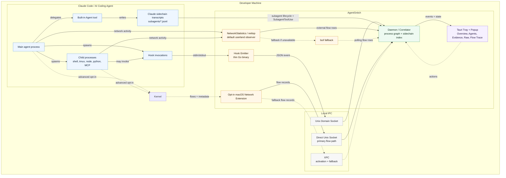
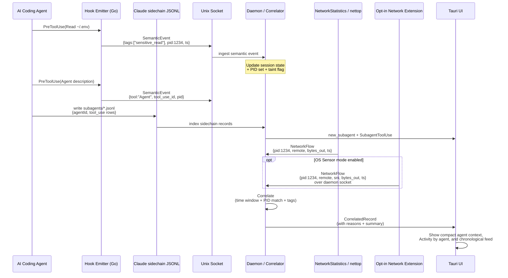
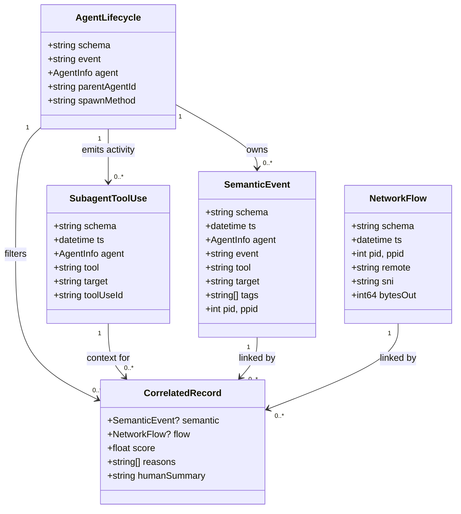

# AgentSnitch Architecture

**Version:** 0.2 (pre-alpha)
**Status:** Implemented pre-alpha; distribution polish remains

---

## 1. Guiding Principles

1. **Sensors, not gates.** Hooks exist to emit high-fidelity semantic signals. They do not decide, block, or even slow down the agent. Userland OS observations are the default network signal; the Network Extension is optional, metadata-only observation. Correlation is the value.
2. **Visibility proves the need.** We are not trying to build the ultimate filter on day one. We are trying to generate undeniable, contextual evidence that makes developers and teams demand better isolation and controls.
3. **Activate on demand.** The entire observation and UI stack should be cheap or inert when no AI coding agent is running. The product "wakes up" with the agent.
4. **Local-first and minimal trust.** No component of AgentSnitch phones home or sends telemetry to a SaaS backend. All state is short-lived and session-scoped by default. The only product data that ever leaves is what the user explicitly exports. Reverse-DNS destination labeling is disabled by default; if a user explicitly enables it from Settings, the daemon may ask the local resolver for PTR labels. The Settings copy treats that as outbound DNS by nature and exposes a separate **Always On** checkbox for persisting the daemon env switch through restarts and reboots.
5. **Correlation is the product.** Neither raw hook logs nor raw network flows are particularly interesting by themselves. The magic is in linking "the agent just read something sensitive" with "and then bytes actually left the machine toward X". Advanced HTTPS Inspect Mode follows the same rule: inspected HTTP evidence is valuable because it is local, scoped to managed agent proxy traffic, and correlated with session/tool context.
6. **Embrace the moving target.** Hook surfaces will change and differ per agent. We treat them as best-effort, high-value signals and use the least-privileged OS network observation that produces enough evidence.

### 1.1 Product Promises

AgentSnitch has three promises to keep:

1. **Semantic truth from hooks.** Claude, Codex, Cursor, and similar agent hooks tell AgentSnitch what the agent is doing semantically: "the agent is about to read this file," "it ran this shell command," "it invoked this MCP tool," or "this output contained credential-looking material."
2. **Network truth from the OS.** The default daemon path uses unprivileged NetworkStatistics/`nettop` observations plus process snapshots to tell AgentSnitch which agent-like PID/process has an outbound flow. The optional Network Extension provides stronger audit-token attribution when explicitly enabled.
3. **Explainable correlation.** The daemon stitches those streams into local evidence: "this agent session touched sensitive local context, then this same process tree made outbound network activity within N seconds."

That is the product.

Product data must be sensor-derived. The app should not ship demo events, simulated detections, seeded cards, or raw UI/API paths that let arbitrary prepared JSON masquerade as agent evidence. Test fixtures may construct events for unit tests, but product runtime data comes from real agent hooks, OS network observation, the managed HTTPS inspect proxy when explicitly enabled, and daemon correlation.

AgentSnitch is not an anti-tamper EDR. The daemon hardens local socket peer checks and rejects arbitrary product ingestion paths, but a same-user process that can intentionally invoke the installed emitter or otherwise act with the developer's privileges is still inside the local trust boundary.

### 1.2 MVP Implementation Order

1. **Make hook emission boring and reliable.** Hooks are detection points, so the emitter must be tiny, fail-open, fast, and easy to verify with `doctor`.
2. **Keep the default path unprivileged.** The installed MVP path uses hooks plus daemon-side process graph tracking and NetworkStatistics/`nettop` observations for agent-like process trees, with `lsof` as fallback. The Network Extension is opt-in only.
3. **Build process-tree tracking in the daemon.** Seed from hook PIDs and PPIDs, snapshot ancestors and children for known agent roots, track CLI agents separately from desktop helper processes, expire stale PIDs, and attach confidence reasons such as exact PID, parent, ancestor, or known-agent match.
4. **Correlate conservatively.** Highlight a small set of high-signal cases: sensitive read followed by external flow, network-looking shell commands with nearby flows, MCP use followed by MCP-server flow, and existing external connections after sensitive access as lower confidence.
5. **Make the UI evidence-first.** The primary artifact should be a linked evidence card, not raw logs: what sensitive context was touched, what outbound activity followed, and why the daemon linked them.
6. **Keep verification real-data only.** AgentSnitch should not fabricate sensitive-read or network-flow cards. Local verification should prove that hooks, daemon, UI, and the active network observer are live, then wait for real Claude Code activity to produce evidence.
7. **Keep claims precise.** Prefer "linked", "correlated", "after sensitive access", "same process tree", and "outbound activity". Avoid claims like "exfiltrated", "leaked", or "stolen" unless stronger evidence exists.

---

## 2. High-Level System Diagram



The observation paths (semantic hooks, Claude sidechain transcripts, default userland network rows, and optional Network Extension flows) converge only in the daemon. The Network Extension path forwards flow records directly to the daemon Unix socket configured by the host app when the user explicitly enables OS Sensor mode; the XPC bridge remains for activation, configuration, and fallback forwarding.

### 2.1 Event & Correlation Flow (Sequence)



This sequence illustrates the core "visibility proves the risk" loop. The emitter, sidechain transcript indexer, and NE are independent local sensors; the daemon performs the join that none can do alone.

---

## 3. Core Components

### 3.1 Hook Emitter (Sensor)

**Language:** Go (small static binary, easy to reuse logic from prior work).

**Responsibilities:**
- Registered as the command that the agent's hook system invokes (e.g. `agentsnitch-emit pretooluse` or similar).
- Reads the raw hook payload from stdin (or the wire format the agent sends).
- Uses an adapted version of the prior agent adapter layer (`internal/agent`) to normalize into a stable `HookEvent` / `SemanticEvent` shape.
- Applies lightweight classification (adapted from prior `classify/` package) to add tags:
  - `sensitive_read` (known credential paths + read programs, input redirection, literal paths in one-liners, etc.)
  - `credential_output` / `structured_secret`
  - `external_egress_attempt` (shell commands that look like curl/wget/fetch to non-local hosts)
  - `mcp_tool_use`, `mcp_response_ingest`
  - `posture_change` (writes to agent config, CLAUDE.md, .mcp.json, etc.)
  - `subagent` / delegation signals
- Claude Code `Agent` tool launches are treated as hook-inferred sub-agents even when Claude Code keeps the work inside the existing CLI process. The daemon creates a child `agentsnitch.agent.v0` lifecycle record keyed by `tool_use_id`, uses `input_summary.description` as the displayed sub-agent name, preserves the hook PID, and tags the corresponding hook event with that sub-agent.
- Enriches with:
  - Timestamp (high resolution)
  - PID of the emitter process (child of the agent)
  - CWD, session identifiers if available
  - Raw or redacted snippet for context (never raw secrets)
- Writes a single structured event (JSON) to the local unix domain socket (non-blocking or very short timeout).
- Immediately formats and writes the minimal "proceed / allow the tool" response that the specific agent expects on stdout/stderr. Zero policy evaluation.

**Key files (proposed):**
- `cmd/emitter/main.go`
- `internal/agent/` (vendored/adapted adapters + specs for Claude, Cursor, etc.)
- `internal/classify/` (targeted taggers only — no full policy)
- `internal/event/` (common event types)

**Design notes:**
- The emitter must be extremely fast and reliable. If it crashes or hangs, the agent's hook may time out or the tool call may be affected. Keep it tiny.
- Always fail-open for the agent (return proceed). We are observers.
- One emitter binary can handle multiple event types via subcommand or first argument.
- The emitter is not responsible for reading Claude sidechain transcript files. It only supplies the hook context and transcript references that let the daemon index sidechain activity safely.

### 3.2 Network Extension (Ground Truth)

**Technology:** macOS System Extension using Network Extension framework.

**Current status:** The pre-alpha ships with OS Sensor mode disabled by default. The default network path is daemon-side NetworkStatistics/`nettop` observation filtered to external flows from known or likely AI agent process trees, enriched by periodic `ps` snapshots. If that observer is unavailable, the daemon falls back to `lsof`/process snapshot observation. When a user explicitly enables OS Sensor mode, the bundled event-driven `NEFilterDataProvider` emits metadata-only `network_extension` flow events into the daemon.

**Provider choice:**
- `NEFilterDataProvider` only. AgentSnitch must not use transparent proxy, packet tunnel, DNS proxy, or app proxy providers in the shipped product.
- The extension is metadata-only, fail-open, and never owns, proxies, forwards, blocks, or rewrites user traffic.

**What we capture (minimum):**
- Timestamp
- Source process attribution: audit token → PID, effective UID, code signing info, bundle identifier / path
- Local and remote endpoint (IP + port)
- Protocol (TCP/UDP)
- For TLS: SNI if visible during handshake (many NE flows expose this)
- Direction and flow UUID/identifier. Byte lifecycle callbacks are disabled by default and reserved for explicit debug work only.

**Attribution challenges & mitigations:**
- The main agent process (e.g. `claude`) often spawns children (`/bin/sh`, `node`, `python`, MCP servers via stdio or separate processes).
- We need to track not just exact PID but ancestor relationships. The daemon will maintain a short-lived "agent process tree" model seeded by hook events (which give us PIDs of hook children) + periodic or event-driven process snapshotting.
- The extension can also report the `sourceAppIdentifier` or signing team.

**Integration with the rest of the app:**
- The System Extension lives inside (or is bundled with) the Tauri application bundle but is disabled until the user opts in from Settings.
- Communication from extension to daemon is direct Unix socket forwarding for the optional data path. The host bridge exposes activation/configuration and the UI kill switch.
- The containing app must hold the necessary entitlements and be properly signed/notarized for distribution.
- AgentSnitch must not fabricate sensitive-read or network-flow evidence as a product path.

**OS Sensor safety invariants:**
- `NEFilterDataProvider`, not transparent proxy, packet tunnel, app proxy, or DNS proxy.
- No `filterDataVerdict` byte callbacks by default.
- No `URLSession`, `NWConnection`, external sockets, remote clients, inbound listeners, blocking/drop decisions, or proxy/forwarding behavior in the extension.
- Only local IPC to the daemon, bounded payload size, and fail-open behavior when the daemon is absent or unhealthy.
- `scripts/check-network-extension-invariants.sh` enforces the provider, entitlement, fail-open, no-proxy, no-external-socket, no-inbound-listener, and default byte-capture-off invariants in CI.
- **Delivery never runs on the flow-decision path.** `handleNewFlow` returns `.allow()` synchronously; flow events are enqueued to a bounded background queue and the blocking socket `connect`/`write` happens off-path. A wedged or slow daemon can therefore never stall a network verdict. The queue is capped (drop-oldest) and the daemon socket carries a send timeout, so a stuck reader degrades observation but never traffic.
- **The user can always recover their network independently of AgentSnitch.** Disabling OS Sensor mode from Settings tears the filter down and verifies it; uninstall (`scripts/uninstall.sh`) deactivates the system extension via `systemextensionsctl` and prints the OS-level escape hatches (System Settings → Network → Filters, `systemextensionsctl list`, Safe Mode boot). These do not depend on AgentSnitch being healthy.

### 3.3 Daemon / Correlator

**Language:** Go (for speed of iteration and reuse of event types) or Rust (if we want to share more with the Tauri side). Initial bias toward Go for the sensor/daemon pieces.

**Responsibilities:**
- Listen on the unix domain socket for semantic events from emitters.
- Receive flow records from the unprivileged NetworkStatistics/`nettop` observer by default, fall back to `lsof` when needed, and accept direct Network Extension daemon socket records only when the user opts into OS Sensor mode.
- Extract host-level semantic destination intent from tool inputs before network proof exists. This includes WebFetch URLs, shell/MCP URL-like values, and conservative provider hints for WebSearch such as GitHub.
- Index Claude Code sidechain transcripts referenced by hook payloads and sibling `subagents/*.jsonl` files. Sidechain records create `agentsnitch.agent.v0` subagent lifecycle events and sidechain `tool_use` rows become `SubagentToolUse` semantic activity attributed to the subagent.
- Maintain **per-agent-session state** in the daemon, not just in the UI:
  - Current "active agent" (which binary, PID of root process, start time, project/CWD if known).
  - Recent semantic events (ring buffer, last N or last T seconds).
  - Observed PIDs / process groups belonging to this agent run (seeded by emitters + augmented by process monitoring).
  - Main-agent and subagent hierarchy, including OS-process children, hook-inferred `Agent` tool children, and Claude sidechain children.
  - Simple taint / interestingness accumulator (e.g., "has_seen_sensitive_read_in_this_session", list of high-value files touched, recent MCP servers).
  - List of "interesting" network events already surfaced.
- Route network observations to candidate sessions by process graph membership so session taint, first-destination boosts, noisy-pattern suppression, and subagent parentage cannot bleed between concurrent Claude Code sessions in different projects.
- Perform correlation on every incoming network flow (and periodically):
  - Time window join against recent semantic events.
  - Reverse time-window join when a later semantic event, especially `PostToolUse`, arrives after an already-active flow.
  - Process ancestry / PID set membership.
  - Boost score if the semantic event was an explicit egress tool (Bash with curl, MCP, WebFetch, WebSearch, etc.) and the destination roughly matches.
  - Apply interestingness rules (see below).
- Expose a local-only interface for the UI (events, current session summary, queries):
  - Unix domain socket owned by the current user for daemon-to-UI event forwarding.
  - Tauri commands for querying the UI process' in-memory ring.
  - File-backed transcript for export/history, not as a fabricated event source.
- Persist a lightweight append-only transcript for the current session (JSONL on disk under `~/.agentsnitch/sessions/<id>/`). This is the source of truth for export and is output-only; transcript files must not be replayed as product events.
- Handle lifecycle: agent start (first hook or process), agent stop (Stop hook, process exit detection), session rollover.

**Interestingness heuristics (MVP):**
- Any external (non-127.0.0.1 / ::1 / localhost) flow that occurs within a short window after a `sensitive_read` tagged event in the same process tree.
- High outbound byte count (> threshold) after any file read or MCP response ingestion.
- Connection to a host never previously seen in this agent session, especially after sensitive access.
- Expected network-heavy automation tools such as Playwright/browser MCP actions are surfaced once per destination pattern, then suppressed for the rest of the session unless the flow is sensitive, high-byte, or a new destination.
- The UI also supports per-project per-card pattern quieting. Quieting a linked pattern removes matching lower-signal cards from the current feed, persists the pattern under the current project path, and suppresses future matching cards by exact pattern, tool/destination, and browser-automation family/category when applicable; high-risk evidence can still break through.
- The UI has a global preset for quieting known Claude, Playwright bridge, telemetry/logging, package registry, and local development bridge/tunnel traffic.
- Known low-risk categories are collapsed by default in the linked feed: known Claude service, telemetry/logging, Playwright bridge traffic, package registry, and local dev server bridge. The group can be expanded, quieted by category, or exported while the raw evidence remains in the session.
- Localhost MCP/browser targets that correlate with an external flow are titled as local bridge activity, not merely generic network-looking tools.
- Generic tool egress cards use the product label `Tool call → outbound connection`, avoiding the older "network-looking tool" phrasing. High-byte MCP cards use a more specific large-transfer title, known Claude flows use informational service-traffic titles, and credential-like output followed by network activity uses `Credential context → outbound connection`.
- Linked evidence carries destination categories for noise reduction: known Claude service, Playwright bridge traffic, telemetry/logging, package registry, local dev server bridge, local dev server, local dev tunnel, or unknown external.
- Known safe destinations such as Anthropic/Claude service, telemetry hosts, package registries, and local development bridges are risk-low unless linked to sensitive/credential context.
- Flows that look like data exfil (POST/PUT with volume) after credential-like activity.
- Any flow from a sub-agent or delegated context after untrusted content ingestion.

The heuristics are intentionally simple and explainable. The UI should be able to show "why this was highlighted" by pointing at the triggering semantic + network pair.

**Process graph and confidence (current MVP shape):**
- The daemon keeps a short-lived in-memory process graph keyed by PID with PPID, name/source, and `last_seen`.
- Hook events seed the graph with the emitter PID and PPID.
- Network events seed the graph with the flow PID and PPID when available.
- The daemon periodically snapshots the local process table and enriches the graph with ancestors and descendants of known agent PIDs.
- Process snapshots include process start time when the platform exposes it. If the current process table proves a semantic event's PID or PPID was born after that semantic event, the correlator refuses to use that stale PID for a linked evidence card.
- Known agent binaries are classified separately from process-tree membership; Claude Code CLI is distinct from desktop Claude helper processes.
- Claude Code sidechain transcript rows seed subagent identity and activity even when macOS does not expose a separate durable subagent process. The reverse-engineered transcript scanning and prompt-shape heuristics live behind the daemon's sidechain indexer boundary so they can change without being interleaved with durable process-graph detection.
- Default NetworkStatistics/`nettop` flow observation catches more short-lived flow rows than `lsof` while staying unprivileged, then enriches observed PIDs with PPID/process metadata from `ps` snapshots. If the process has already exited before the snapshot, parentage can still be missing; the optional Network Extension can provide stronger process/audit-token attribution and event-driven flow visibility when explicitly enabled.
- PIDs expire after a short TTL to reduce PID reuse risk.
- Correlation reasons are intentionally explicit:
  - `pid_match` means the semantic event PID and flow PID are the same.
  - `parent_match` means one side directly names the other as parent.
  - `ancestor_match` means the in-memory process graph links the semantic PID and flow PID by ancestry.
  - `common_agent_ancestor` means the hook process and flow process sit on separate branches under a shared ancestor that is already tracked as part of the agent session; this is weaker than direct ancestry and is ignored for untracked common parents.
  - `same_agent_session` means both events share a known parent/root but are otherwise siblings; this is lower confidence.
  - `known_agent_binary_match` means the flow came from a recognized CLI agent binary matching the semantic event's agent id; this is low confidence and does not apply to desktop helper binaries by name alone.
  - `mcp_server_flow` means an MCP tool event was already process/time-linked to a flow whose process identity looks like an MCP server. It explains the relationship but must not create a correlation by itself.
  - `first_destination` means this destination has not yet been surfaced as linked evidence in the current session; this boosts score and prevents expected automation from being hidden the first time.
  - `high_bytes` means the observed flow moved at least 1 MiB in either direction; this boosts score and prevents repeat-pattern suppression.
  - `within_10s` means the semantic event and network flow occurred inside the current conservative correlation window.
  - `existing_connection_active` means the flow was already active shortly before a later sensitive or explicit-egress semantic event arrived, which covers `PostToolUse` timing for tools such as WebSearch.
  - `after_sensitive_read` means the linked semantic event carried sensitive tags.
- Correlated records also carry a compact `process_tree` slice so the UI and exports can show the hook process, network process, and relevant ancestors without requiring raw process-table replay.
- Broad session taint alone must not create a highlighted correlation. It can influence context, but a linked evidence card needs a process relationship plus a time-window relationship.
- Ordinary `Bash`, `Write`, or `Edit` events must not be treated as network-looking by tool name alone. They need a sensitive tag, an explicit egress tag such as `external_egress_attempt`, or another high-signal semantic reason before a nearby flow becomes a linked evidence card.

### 3.4 Tauri UI (Tray + Popup)

**Framework:** Tauri (v2 preferred) — Rust backend + web frontend (or minimal if we can keep the UI very small).

**Why Tauri:**
- Small binary size.
- Excellent macOS tray / menu bar support.
- Can bundle the System Extension.
- User already has experience with Tauri in the workspace (openwork reference).
- Webview gives flexibility for a nice event list without writing full native UI.

**Activation & Visibility Model:**
- The app is installed and can run in the background (login item or launched on demand).
- Primary surface is a **menu bar / status item** (NSStatusItem equivalent via Tauri).
  - Icon is neutral / gray when idle.
  - Icon badges or changes color when an AI coding agent is detected active.
- When an agent is active or an "interesting" event arrives, the app can:
  - Bounce the icon.
  - Automatically open a small **popover or panel** (positioned near the menu bar or as a compact floating window "from the top").
  - The panel is deliberately small — think Little Snitch connection alert size or a macOS Notification Center widget that expanded. Not a full 800x600 app window.
- Clicking the status item always shows the current session view (or last session summary).
- When the agent session ends, the panel can auto-collapse after a short time or offer an explicit "Review & Close" that archives the transcript.

**Panel Content (MVP):**
- Header: "Claude Code • /Users/you/project • active 14m"
- Default tab: `Overview`, followed by `Agents`, `Evidence`, `Raw`, and `Flow Trace`. Overview summarizes the live session, readiness, agent context, and what needs attention. Evidence is the deduped attention-worthy and correlated feed. Raw is the firehose with hook/network sub-filters. Flow Trace visualizes agent/subagent/tool/destination paths.
- `Raw` is raw observed hook and network visibility. `Evidence` is semantic-plus-network evidence produced by the correlator plus high-signal attention items. `Flow Trace` is an aggregate view over the same live evidence rather than a separate sensor.
- Evidence tabs show a compact `Claude Code (subagents)` context. Each main agent is represented as `Main (N)` with event counts and a click-to-expand child strip, so large teams do not consume the whole window by default.
- `Activity by agent` sits beside the compact agent context when agent activity exists. The chronological feed stays underneath both panels.
- The dedicated `Agents` tab shows the full main-to-child hierarchy with names, PIDs when available, spawn method, and event counts. Clicking an agent filters to that agent's event stream.
- Scrollable list of events (most recent first or chronological).
  - Each row: timestamp, short human summary ("Read ~/.env", "Bash: curl -X POST https://..."), tags as pills (🔴 sensitive, 🌐 egress), linked network details if correlated ("→ 93.184.216.34:443 (SNI: foo.example) 2.1KB").
- Correlated / high-interest rows are visually distinct (red border, bold, grouped).
- Linked cards show decision state separately from risk and correlation confidence. The current non-blocking product state is `Observed`; future blocking can reuse the same slot for `Allowed`, `Blocked`, or `Would Block`.
- Lower-signal linked rows default to a compact form that keeps destination, category, why, risk, decision, and correlation visible; expanding the card with `Explain` reveals hook/network lines and replay steps. Raw reasons and process-tree details stay collapsed behind `Raw Event` / `Raw Details` controls.
- Known low-risk linked service rows collapse into category groups by default so routine Claude, telemetry, package registry, Playwright bridge, and local bridge traffic does not dominate the main linked feed.
- A compact session summary shows totals for known Claude/bridge traffic, telemetry, local bridge/tunnel traffic, package traffic, high-signal cards, and new destinations.
- Reason filters in `Evidence` stay compact and appear only when there are multiple useful reasons or an active reason/agent filter to clear; there is no large standalone reason-summary block.
- Actions per event or globally: Copy as JSON, Copy human text, "Quiet this host for rest of session", "Export session transcript".
- Footer: "All local. Session transcript saved to ~/.agentsnitch/..."

**Technical notes:**
- The Rust side of Tauri loads the Swift host bridge for System Extension activation and configuration, then talks to the Go daemon over local sockets.
- Live updates: daemon forwards validated events to the UI Unix socket; the Tauri side emits in-process UI events.
- Settings are intentionally split by audience: General contains interface mode, Hooks contains Claude Code hook management and hook startup refresh, Advanced contains OS Sensor mode plus Reverse DNS/PTR labels, and Developer contains HTTPS Inspect Mode, CA/system trust actions, payload capture, and the hidden-by-default Debug snapshot button.
- The current web UI is evidence-first: tabs separate `Overview`, `Agents`, `Evidence`, `Raw`, and `Flow Trace`, and the UI ring preferentially preserves linked evidence and subagent activity before routine hook or raw network rows. Repeated lower-signal linked cards with the same title, hook tool, and destination are grouped in evidence views, and known low-risk linked service traffic is collapsed by category.
- The `Explain` view acts as a mini replay: tool call, target, process, network flow, correlation reasons, and observed decision.
- Quiet preferences are stored locally in `~/.agentsnitch/ui-quiet-preferences.json` with restricted file permissions on Unix platforms. Global known-service keys apply before a project is known; project-specific keys are merged once the first semantic event establishes the session working directory.
- The app window auto-resizes from measured live layout. Quiet sessions remain compact; teams, activity panels, and larger event volume can grow the window within conservative screen bounds.
- The active session expires automatically when semantic/lifecycle activity is older than the idle timeout and no CLI agent process is still running. Network-only observations do not keep the UI session alive.
- The web frontend should be extremely restrained — minimal CSS, no heavy frameworks if possible, or a tiny Svelte/Vue if it speeds development. Goal is clarity and speed, not polish.

---

## 4. Data Models (Proposed)

### Semantic Event (from emitter)

```json
{
  "schema": "agentsnitch.semantic.v0",
  "ts": "2026-06-02T14:23:05.123Z",
  "agent": { "id": "claude", "name": "Claude Code", "version": "..." },
  "session": { "id": "..." },
  "event": "PreToolUse",
  "tool": "Read",
  "target": "/Users/scott/.env",
  "cwd": "/Users/scott/project",
  "pid": 48721,
  "ppid": 48650,
  "tags": ["sensitive_read", "env_file"],
  "destination_intents": ["example.com"],
  "tool_use_id": "toolu_xxx",
  "input_summary": { "file_path": "/Users/scott/.env" },
  "raw_ref": "..."   // optional pointer into transcript for debugging
}
```

PostToolUse events carry `output_summary` or classification of the result (e.g., "contained_credential_markers"). `destination_intents` are optional host-level semantic hints. They improve linked evidence display but do not replace OS network observation.

### Agent Lifecycle and Subagent Activity

Process-backed subagents, hook-inferred Claude `Agent` tool launches, and Claude sidechain transcript agents all use the same lifecycle envelope:

```json
{
  "schema": "agentsnitch.agent.v0",
  "event": "new_subagent",
  "agent": {
    "id": "subchain_<agentId>",
    "type": "sub",
    "name": "QA Login/Register/AuthLayout",
    "pid": 14453,
    "parent_agent_id": "main_14453",
    "spawn_method": "claude_sidechain",
    "version": "<agentId>"
  }
}
```

Claude sidechain `tool_use` rows are normalized as semantic activity instead of fabricated hook events:

```json
{
  "schema": "agentsnitch.semantic.v0",
  "event": "SubagentToolUse",
  "tool": "Read",
  "target": "/Users/example/project/src/App.tsx",
  "tool_use_id": "<sidechain-tool-use-id>",
  "tags": ["claude_sidechain", "subagent_activity"],
  "agent": {
    "id": "subchain_<agentId>",
    "type": "sub",
    "parent_agent_id": "main_14453",
    "spawn_method": "claude_sidechain"
  }
}
```

### Network Flow Event (from NE)

```json
{
  "schema": "agentsnitch.network.v0",
  "ts": "2026-06-02T14:23:09.456Z",
  "flow_id": "uuid-or-ne-identifier",
  "observer": "network_extension",
  "pid": 48721,
  "ppid": 48650,
  "process_path": "/Applications/Claude.app/Contents/MacOS/Claude",
  "process_bundle_id": "com.anthropic.claude",
  "process_team_id": "...",
  "signing_info": { "team": "...", "identifier": "..." },
  "local": "192.168.1.42:54321",
  "remote": "93.184.216.34:443",
  "sni": "api.example.com",
  "protocol": "tcp",
  "direction": "out",
  "bytes_out": 2143,
  "bytes_in": 892,
  "state": "established"   // or closed, etc.
}
```

### Correlated / Interesting Record (internal + UI)

The daemon produces derived records that the UI consumes:

- Link between one or more semantic events and one or more network flows.
- Score + reasons (list of matching rules).
- Human-renderable summary plus `why_human`, severity, decision, risk, destination category, destination, replay steps, debug details, session summary, and process-tree evidence.

The on-disk session transcript stores raw incoming events plus derived correlations for debugging and reproducibility. UI export writes a schema-tagged JSONL session header followed by event records; export is output-only and is not an event ingestion path.

Example linked evidence shape:

```json
{
  "record_type": "event",
  "schema": "agentsnitch.export.v0",
  "kind": "correlated",
  "severity": "hot",
  "risk": "high",
  "decision": "observed",
  "why_human": "same process tree, within 10 seconds, after reading sensitive local context",
  "destination": "api.example.com",
  "destination_category": "known Claude service",
  "raw_reasons": ["within_10s", "ancestor_match", "after_sensitive_read"],
  "replay": [
    { "label": "1. Tool call", "value": "PreToolUse Read" },
    { "label": "4. Network", "value": "PID 48730 connected to api.example.com:443" },
    { "label": "6. Decision", "value": "observed; correlation high 0.95" }
  ],
  "process_tree": [
    { "pid": 48650, "name": "claude", "role": "ancestor" },
    { "pid": 48721, "ppid": 48650, "name": "sh", "role": "hook" },
    { "pid": 48730, "ppid": 48721, "name": "curl", "role": "network" }
  ]
}
```

### Event Relationships



---

## 5. IPC & Lifetime

- **Emitter → Daemon:** Unix domain socket (datagram or stream). JSON lines or length-prefixed messages. Fire-and-forget from emitter perspective. Daemon can acknowledge for diagnostics but not block.
- **Claude sidechain transcripts → Daemon:** Local file reads under the active Claude transcript/project path only after hook context points at the session. The daemon indexes `subagents/*.jsonl` for lifecycle and activity, de-dupes replayed rows, and does not treat arbitrary local transcript files as product input.
- **Network Extension → Daemon/App:** Direct daemon Unix socket for primary flow forwarding, with XPC available for activation, configuration, and fallback forwarding.
- **Daemon → Tauri UI:** Unix domain socket under `~/.agentsnitch/ui.sock`; the UI accepts only daemon-forwarded validated events and exposes query state through Tauri commands.
- **Process lifetime:** The Tauri app can launch the daemon on startup (or use launchd for a true background service). Emitters are short-lived children of the agent.

Session end detection: combination of `Stop` / `SessionEnd` hooks + polling or kqueue for death of the root agent PID.

---

## 6. Installation & Packaging

**Hook registration path (inspired by but much lighter than prior work):**
- Installer detects agents via the same `DetectInstallation` + binary name / config dir logic.
- For each supported agent, writes (or merges) the hook configuration pointing at the installed emitter binary + appropriate subcommand/flag.
- On uninstall, removes or comments out the registrations (or uses a managed subtree key so the agent config remains clean).

**App + Extension packaging:**
- The deliverable is a macOS `.app` bundle (Tauri produces this).
- The bundle may contain the Network Extension as an embedded optional system extension target.
- Entitlements required (com.apple.developer.networking.networkextension, etc.).
- Signing + notarization needed for easy distribution.
- The main local install path is `make create`: build Go tools, build the Tauri app, install `/Applications/AgentSnitch.app`, embed/sign the Network Extension and host bridge, install support binaries, install/start the user LaunchAgent, launch the app, and run `doctor`. Claude Code hooks are not installed automatically by `make create`; the user installs or updates them from Settings -> Hooks, or manually with `make install`.
- First launch does not activate the Network Extension. Enabling OS Sensor mode from Settings triggers the user approval flow in System Settings → Privacy & Security → System Extensions (and Network Extension / Content Filter if categorized that way).

**Daemon registration:**
- The current full install uses a per-user LaunchAgent. It keeps the unprivileged NetworkStatistics/`nettop` observer enabled by default, keeps `lsof` available as fallback, and does not require a root daemon.
- The tray app itself can contain the correlator logic if we keep the Go piece small or rewrite the daemon side in Rust over time.

---

## 7. Security & Privacy Considerations

- The emitter runs with the privileges of the hook-invoking agent (usually the developer's full user context). It must not be a vector for privilege escalation.
- The System Extension runs with elevated network privileges. Its attack surface must be minimized (no parsing of untrusted data beyond what the kernel already gave it).
- All sockets and XPC are local only. No network listeners.
- AgentSnitch transcripts under `~/.agentsnitch` contain file paths, command snippets, destinations, and derived evidence. Claude sidechain transcripts under project-local `.claude/.../subagents/*.jsonl` may also be sensitive when indexed. The tool should document this and default its own written files to restrictive permissions (0600).
- The tool itself should never initiate unexpected outbound connections. Any "phone home" (even for destination reputation) must be opt-in and clearly disclosed.
- Export is the only sanctioned way for data to leave the machine.
- Repository contents must not contain real credentials, signing keys, provisioning profiles, notary credentials, local runtime transcripts, or realistic token-shaped fixtures. Scanner-safe placeholders are required in docs and tests.

---

## 8. Limitations & Known Tradeoffs (Honest)

- **Attribution is hard.** Shells, `exec`, MCP servers launched as separate processes, sub-agents, and "run in terminal" features all blur the process tree. We will have false negatives (missed correlations) and some false positives. The UI must make uncertainty visible ("probable link", "time-based only").
- **Hooks are incomplete.** Not every code path an agent can take goes through a hooked tool. Direct syscalls from a child, or the agent using the user's existing shell outside the agent context, will only be visible on the network side (losing the "why").
- **Default userland attribution is still best-effort.** NetworkStatistics/`nettop` reduces the old `lsof` poll-aliasing blind spot, but parent/process enrichment still depends on process snapshots. A helper can connect and exit before `ps` captures its ancestry; the opt-in Network Extension remains the strongest event-driven attribution path.
- **PID identity is still best-effort.** The daemon now checks PPID, executable identity, TTL, and process start time where available before linking by PID. If start time is unavailable or too coarse, a sufficiently unlucky PID reuse can still become ambiguous, so correlation language must stay probabilistic.
- **Long-lived connections.** A connection opened while clean that later carries exfiltrated data after a secret read is a real gap. Time-based "this connection was open when sensitive material was read" annotations help, but perfect teardown is hard without shaping.
- **SNI vs. reality.** SNI is helpful but can be absent or misleading (ECH, IP-only, etc.).
- **Semantic transformation.** An agent that reads `.env`, then later makes a "normal" API call that happens to include paraphrased secret data may not produce an obvious mechanical link. We surface the pattern; the human judges intent.
- **System Extension UX tax.** Users must approve it. Some corporate MDM environments restrict extensions. We must make the value obvious quickly.
- **No content visibility inside TLS by default.** The default NetworkStatistics/`nettop`, `lsof`, and OS Sensor paths are metadata/process attribution paths. Advanced HTTPS Inspect Mode is a separate Settings -> Developer feature for managed proxy traffic only; it uses local CA material, process-scoped trust by default, optional administrator-approved macOS System trust, redacted previews by default, metadata-only CONNECT endpoint/byte/duration evidence when decryption is unavailable, and redacted full-payload records only when explicitly enabled.

These are accepted for Phase 1. Many of them become more tractable once we have real data and user feedback.

---

## 9. Proposed Initial Directory Structure

```
agentsnitch/
├── readme.md
├── architecture.md
├── LICENSE
├── .gitignore
├── Makefile                 # build, install, test, package targets
├── cmd/
│   ├── emitter/
│   │   └── main.go
│   ├── agentsnitch/         # CLI helper, including HTTPS Inspect commands
│   └── daemon/              # (or merge into Tauri Rust side later)
│       └── main.go
├── internal/
│   ├── agent/               # adapted adapters + specs
│   ├── classify/
│   ├── event/               # shared types + wire
│   ├── inspect/             # HTTPS Inspect settings, CA, trust, status helpers
│   └── correlator/          # session state, join logic, scoring
├── pkg/                     # shared small utilities if needed
├── ui/                      # Tauri project root
│   ├── src-tauri/
│   │   ├── src/
│   │   ├── tauri.conf.json
│   │   └── ...
│   └── src/                 # web frontend (minimal)
├── extension/               # Network Extension sources (Swift/ObjC or headers)
│   └── ...
├── scripts/
│   ├── install.sh
│   ├── check-network-extension-invariants.sh
│   └── uninstall.sh
├── docs/
│   └── ...
└── testdata/                # recorded hook payloads and flow fixtures used only by tests
```

The exact split between Go daemon and Rust Tauri side will be refined during implementation. The important boundary is that the **observation and correlation logic** is separate from the **presentation layer**.

---

## 10. Current Implementation Status

Implemented locally:

1. Claude Code hook emitter and hook installer with fail-open behavior and `doctor` verification.
2. Go daemon with semantic event ingestion, real Network Extension ingestion, process graph enrichment, Claude sidechain transcript indexing, conservative correlation, transcript output, and UI forwarding.
3. macOS Network Extension packaging path with direct daemon socket forwarding, host bridge activation/configuration, signing, and notarization support through `make create`.
4. Tauri UI popup with evidence-first tabs, compact `Claude Code (subagents)` context, dedicated `Agents` tab, per-agent activity, agent filtering, auto-resizing, and retention that favors linked evidence over routine event noise.
5. Real-data-only verification path: hooks, daemon, UI, and the active network observer must all be live before claims are made. The default observer is NetworkStatistics/`nettop`; OS Sensor is optional.

Remaining work is distribution polish: a stable installer/uninstaller, smoother System Extension approval flow, broader agent support, and longer-session UX.

---

*Architecture will evolve as we hit real macOS constraints and learn from live agent sessions.*
