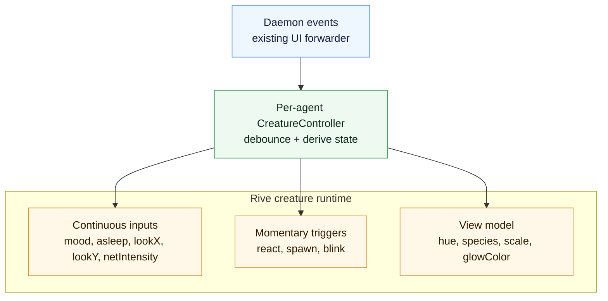

# AgentSnitch Creature Animation Plan

> Status: future UI design note, not part of the current pre-alpha runtime. The
> goal is to replace static agent mockups with live, data-driven animated
> creatures. Each Claude main agent and subagent would get a small character whose
> appearance represents identity and whose motion/face represents current
> activity.

## 0. Why Rive (vs. CSS / Lottie)

- **Rive** — purpose-built for *interactive, state-driven* character animation.
  A single state machine takes runtime **inputs** (booleans/numbers/triggers) and
  picks the right animation + blends between them. This is a 1:1 match for our
  daemon event stream. Tiny WASM runtime, runs in the existing Tauri webview.
- **CSS/SVG** — fine for v1 motion (blink, bob, packet flight) with zero new deps,
  but organic/secondary motion and "feels alive" easing get fiddly by hand.
- **Lottie** — great for *canned* loops, awkward for *data-driven state changes*.
  Skip for this use case.

Decision: **Rive for the creature itself.** Keep the surrounding UI (pens, doors,
labels, rail) as normal HTML/CSS in the webview; only the creature is a `.riv`.

## 1. Runtime & packaging (Tauri webview)

- Package: **`@rive-app/canvas`** (WASM canvas renderer). Lightest option; we are
  not using React in the Tauri front-end shell today, so the framework-agnostic
  canvas runtime is the right call. (`@rive-app/webgl2` only if we need advanced
  effects/meshes later.)
- The runtime is a WASM blob + JS. It loads fine inside a Tauri webview. Bundle the
  `.riv` and `.wasm` as app assets so nothing is fetched from the network — this
  matters: AgentSnitch is **local-only, no phone-home**, so the animation assets
  must ship in the app bundle, not load from a CDN.
- Runtime API shape to verify before implementation:
  - `new rive.Rive({ src, canvas, autoplay, stateMachines, onLoad })`
  - `const inputs = r.stateMachineInputs('<MachineName>')` → array of
    `StateMachineInput { name, value, fire() }`
  - For richer/structured runtime data, **Data Binding / view models**
    (`viewModelInstance`) let us set named properties (e.g. color, mood number,
    bytes) declaratively without hand-wiring every input. Prefer this for the
    per-agent skin (color/shape) and use plain inputs for momentary triggers.

## 2. The state model (maps directly to daemon data)

Daemon already emits everything we need (see `internal/event/event.go`,
`cmd/daemon/*`): agent id/type, spawn_method, tags (`sensitive_read`,
`credential_output`, `mcp_tool_use`, `external_egress_attempt`), network flows
(bytes_out, remote, state), and correlation reasons/confidence.

### State machine inputs (the creature's "nervous system")

| Input            | Type     | Source signal                                                        | Visible behavior |
|------------------|----------|----------------------------------------------------------------------|------------------|
| `mood`           | number   | derived: 0 idle · 1 working · 2 reaching · 3 caught                  | base loop + face |
| `asleep`         | bool     | session idle > N (UI already computes idle timeout)                  | curl + sleep-bob + Zzz |
| `blink`          | trigger  | internal timer (randomized per creature)                            | one blink        |
| `look_x`,`look_y`| number   | direction of most recent destination door (or random idle saccades) | pupils track     |
| `react`          | trigger  | a new correlated/"caught" event arrives                              | startle + lean-in|
| `net_intensity`  | number   | rolling bytes_out (log-scaled 0..1)                                  | breathing speed / glow |
| `spawn`          | trigger  | subagent (hatchling) created                                        | wobble / "pop"   |

### Data-binding (view model) properties — per-creature identity ("go wild")

| Property      | Source                                | Effect |
|---------------|---------------------------------------|--------|
| `hue`         | hash(agent.id) → stable random hue    | body color = identity |
| `species`     | hash(agent.id) % N                     | ear/horn/eye variant (blend or nested artboard swap) |
| `scale`       | main vs. subagent                      | hatchlings are smaller |
| `glow_color`  | risk ramp (calm→amber→ember)           | aura = mood/risk, independent of identity hue |

Key design rule from the Paper round: **color/species = WHO (random, stable),
glow + face = WHAT it's feeling (mood/risk).** Keep those two channels separate so
identity never gets muddied by risk.

## 3. Artboard / rig structure (what to build in the Rive editor)

One artboard, "Snitch", with:

1. **Body** group (squash/stretch bone or scale) — drives bob, breathing, startle.
2. **Eyes** — whites fixed; **pupils** on a constrained translation so `look_x/look_y`
   can aim them; a `blink` trigger drives an eyelid (scaleY) one-shot.
3. **Brow** — two short bars whose angle is keyed by `mood` (neutral → skeptical at
   "caught"). This single element carries most of the personality.
4. **Mouth** — small shape: line (idle) → open grin (caught) → flat (working).
5. **Ears/horns** — the per-species variant; can be a nested artboard or blended.
6. **Glow ring** — a soft radial behind the body; color from `glow_color`, opacity
   pulses with `net_intensity`.
7. **Zzz** — only visible when `asleep`.

State machine "Brain":
- Base layer: `Idle ↔ Working ↔ Reaching ↔ Caught` (blend on `mood`),
  plus an `Asleep` state gated by `asleep`.
- Additive layer: `blink`, `react`, `spawn` one-shots so they can fire *over* any
  base state without interrupting it.

## 4. The data→creature bridge (in the app)

The creature is dumb; the app translates events to inputs.

Derivation rules (initial):
- `mood = 3 (caught)` for ~4s when a correlated "after_sensitive_read" event lands;
  else `2 (reaching)` while a flow to a new/unknown door is active; else
  `1 (working)` if any tool event in last ~10s; else `0 (idle)`.
- `asleep = true` once the session idle-timeout the UI already tracks elapses.
- `look_x/look_y` points at the door of the active destination; idle → small random
  saccades on a timer.
- `net_intensity = clamp(log10(bytes_out_window)/6, 0, 1)`.

## 5. Phased experiment

- **Phase A — standalone sandbox (no app changes).** A single `prototype.html` that
  loads one `.riv`, with on-screen buttons to set `mood`, toggle `asleep`, fire
  `react/blink/spawn`, and a fake "bytes" slider → `net_intensity`. This proves the
  rig + the *feel* of the mapping before touching `ui/`. Lives outside the app.
- **Phase B — fake event feed.** Replace the buttons with a scripted timeline that
  replays a realistic session (read .env → reach cloud → caught) so we can judge the
  choreography end-to-end.
- **Phase C — real data, still sandboxed.** Point the controller at a recorded
  session export (the daemon already writes schema-tagged JSONL) and play it back.
- **Phase D — wire into `ui/`.** Only once the mapping feels right: instantiate one
  creature per agent in the real Pen/World views, driven by the live UI event stream.

## 6. Open questions / risks

- **Rig authoring is the real cost.** Building the Rive artboard + state machine is
  designer work (a few hours for a good first creature). Everything downstream
  (runtime wiring) is straightforward and well-documented.
- **Density.** 10–20+ concurrent creatures each running a state machine — need to
  cap active animation (pause off-screen creatures, simplify when many), and the
  "World" view needs clustering / a "needs you" spotlight.
- **Per-creature variety.** Decide: one rig with data-bound hue/species params
  (cheaper, coherent) vs. several nested artboards (more variety, more authoring).
  Recommend: one rig, data-bound color + 3–4 species variants to start.
- **Local-only constraint.** Bundle `.riv` + `.wasm` as app assets; never fetch from
  a CDN at runtime.

## 7. Next concrete step

Build the **Phase A** standalone `prototype.html` harness now (it can run with a
placeholder/simple `.riv` or even a CSS stand-in creature) so the input panel and
the data-derivation logic exist and are testable before the real rig is authored in
the Rive editor.

### Sources
- Rive State Machines guide — https://help.rive.app/runtimes/state-machines
- Rive web/JS parameters — https://help.rive.app/runtimes/overview/web-js/rive-parameters
- Rive Data Binding core concepts — https://rive.app/blog/getting-started-with-data-binding
- rive-wasm runtime — https://github.com/rive-app/rive-wasm
