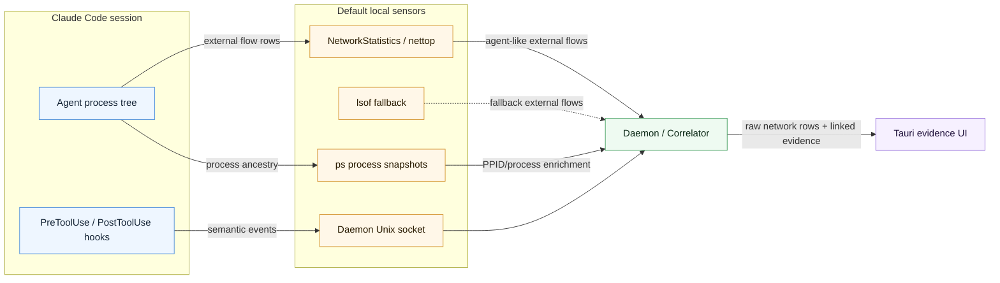

# Getting Started

AgentSnitch is a local-first macOS pre-alpha. The current release path is built around one product loop:

1. hook events provide semantic truth;
2. network events provide OS/process truth;
3. the daemon correlates those streams into explainable local evidence.

## Install The Latest Pre-Alpha

Download [AgentSnitch v0.1.0-pre-alpha.5](https://github.com/somoore/agentsnitch/releases/tag/v0.1.0-pre-alpha.5) and install the macOS `.pkg`.

The installer includes `AgentSnitch.app`, the local daemon, support tools, and LaunchAgent registration. Claude Code hook tooling is included, but hooks are not installed automatically; open AgentSnitch Settings -> Hooks to install or update them explicitly. OS Sensor mode is available as an optional macOS system-extension-backed path, but User Visibility mode is the default unless explicitly changed in app Settings.

## Build

```sh
make build
```

This builds:

- `bin/emitter` - fail-open Claude hook emitter;
- `bin/daemon` - local socket receiver and correlator;
- `bin/doctor` - local health check;
- `bin/hookctl` - Claude Code hook installer/verifier;
- `bin/neready` - production Network Extension readiness checker;
- `bin/agentsnitchctl` - CLI helper for HTTPS Inspect status, CA, trust, and process-scoped environment commands.

The emitter tags linkable network intent from shell network commands, MCP tools, WebFetch, and WebSearch. It also emits `destination_intents` when a tool input implies a host before the OS observer proves the flow, for example a WebFetch URL or an obvious WebSearch provider query such as GitHub.

## Create Full Local Install

```sh
make create
```

This is the one-command build/install path. It builds every Go tool, builds the Tauri app, installs `/Applications/AgentSnitch.app`, embeds and signs the optional Network Extension and host bridge, installs support binaries under `~/Library/Application Support/AgentSnitch/bin`, installs a per-user LaunchAgent for the daemon, starts the daemon, launches the app, and runs `doctor`. Claude Code hooks are managed separately from Settings -> Hooks.

The installed LaunchAgent sets `AGENTSNITCH_DISABLE_NETWORK_STATISTICS=0` and `AGENTSNITCH_DISABLE_LSOF=0` by default. That keeps the shipped/local-install path on semantic hooks plus unprivileged NetworkStatistics/`nettop` process-network correlation, with polling-based `lsof` as a fallback if `nettop` is unavailable. OS Sensor mode is disabled by default and must be enabled explicitly when you need stronger OS-backed attribution. Reverse DNS/PTR lookup is also disabled by default; enable it from Settings only when you need destination-name debugging. The **Always On** checkbox persists `AGENTSNITCH_ENABLE_REVERSE_DNS=1` in the daemon LaunchAgent so the setting survives app exits, daemon restarts, and reboots.

If a single Developer ID Application signing identity is available in the login keychain, `make create` uses it automatically; otherwise it falls back to ad hoc signing with the development entitlements. It also signs the installed support binaries so the LaunchAgent daemon appears as AgentSnitch instead of a generic unsigned `daemon` process.

macOS publisher text comes from the Apple Developer team/certificate name. With an individual Developer ID certificate, macOS will still show the publisher as the certificate holder. To show `AgentSnitch` as the publisher, sign with an Apple Developer organization team whose Developer ID Application certificate is issued to AgentSnitch.

Notarization is automatic when a real signing identity and notary credentials are configured. `make create` first tries the default notarytool keychain profile named `AgentSnitch`, or you can provide another profile:

```sh
AGENTSNITCH_NOTARY_PROFILE=AgentSnitch make create
```

Alternatively set `AGENTSNITCH_NOTARY_APPLE_ID`, `AGENTSNITCH_NOTARY_PASSWORD`, and `AGENTSNITCH_NOTARY_TEAM_ID`. Use `AGENTSNITCH_SKIP_NOTARIZE=1` to skip notarization explicitly.

## Settings

The Settings window is organized around the current product surfaces:

- **General** keeps the app focused or shows advanced diagnostic controls.
- **Hooks** installs, updates, removes, and refreshes Claude Code hook registrations. The "Keep hooks up to date" child setting refreshes installed hook commands when AgentSnitch starts.
- **Advanced** contains OS Sensor mode, the OS Sensor startup default, Reverse DNS / PTR labels, and PTR "Always On". Reverse DNS is disabled by default and may ask the local resolver for PTR labels when enabled.
- **Developer** contains HTTPS Inspect Mode, local CA actions, optional macOS system trust actions, payload capture controls, and the Debug button. The Debug button is hidden by default; enable it here only when you need the footer Debug snapshot control. Its "Always On" child setting keeps the Debug button visible after AgentSnitch restarts.

HTTPS Inspect Mode is intentionally in **Developer** because it can create local CA material and, when full payload capture is explicitly enabled, can retain redacted request and response payload records for inspected managed traffic. The normal app install, package install, daemon start, hook install, and OS Sensor activation never install a trusted root certificate.

## Install Claude Hooks

```sh
make install
```

This builds the emitter and hook manager, then manually installs idempotent Claude Code `PreToolUse` and `PostToolUse` hooks into `~/.claude/settings.json` (or `CLAUDE_SETTINGS` if set). Existing non-AgentSnitch hooks are preserved. Before writing, the installer creates a timestamped backup next to the settings file. The normal app install path does not run this target; Settings -> Hooks is the preferred UI flow.

Remove AgentSnitch with:

```sh
make uninstall
```

This removes the Claude Code hooks, the daemon LaunchAgent, and support binaries
(existing non-AgentSnitch Claude settings are preserved). It also tears down the
optional Network Extension: it deactivates the system extension via
`systemextensionsctl` and prints the OS-level escape hatches in case any content
filter remains. If you ever lose connectivity and need to recover independently
of AgentSnitch, you can always remove the filter via **System Settings → Network
→ Filters**, deactivate the extension listed by `systemextensionsctl list`, or
boot into Safe Mode (third-party content filters do not load there).

Uninstall also checks HTTPS Inspect CA state when `agentsnitchctl` is available. If the AgentSnitch CA is still installed in macOS System trust, uninstall requests the same administrator-approved removal path used by Settings -> Developer or `agentsnitchctl inspect untrust-system`, then prints Keychain Access fallback instructions if macOS refuses automatic removal. It also disables Inspect Mode, removes process-scoped trust files, and purges captured payload data when possible.

## Run

Start the daemon:

```sh
make run-daemon
```

The source-run target sets `AGENTSNITCH_ALLOW_UNSIGNED_PEERS=1` because `go run` does not execute the installed signed daemon binary. Installed builds do not use that escape hatch; socket peers are expected to match AgentSnitch paths and the daemon's signing Team ID.

In a separate terminal, run the Tauri UI from the built app bundle or with Tauri during development.

For OS Sensor verification, first open Settings in the app and turn **OS Sensor mode** on, then disable the userland NetworkStatistics and `lsof` observers so `doctor` and the UI prove that the OS-backed path is producing network events:

```sh
AGENTSNITCH_DISABLE_NETWORK_STATISTICS=1 AGENTSNITCH_DISABLE_LSOF=1 make run-daemon
```

For normal development and shipped installs, leave the default NetworkStatistics observer enabled and keep `lsof` as fallback. The daemon only forwards external flows from agent-like process trees or PIDs already learned from semantic hooks. Treat userland attribution as best-effort visibility: `nettop` catches more short-lived rows than polling `lsof`, but parent/process enrichment can still be incomplete when a helper exits before `ps` sees it.

## Network Observation

The default product path is semantic hooks plus unprivileged userland process/network correlation:



The optional OS Sensor path is:

```mermaid
flowchart LR
    classDef app fill:#eef6ff,stroke:#4c8eda,color:#102033
    classDef sensor fill:#fff7e8,stroke:#d4942f,color:#2a1b00
    classDef daemon fill:#eefaf1,stroke:#3f9d5c,color:#0b2815
    classDef ui fill:#f6f0ff,stroke:#8c63d8,color:#21133d

    Settings["AgentSnitch Settings"]
    NE["OS Sensor macOS telemetry"]
    Socket["Daemon Unix socket"]
    Correlator["Daemon / Correlator"]
    UI["Tauri evidence UI"]

    Settings -->|"user enables OS Sensor mode"| NE
    NE -->|"metadata-only network_extension FlowEvent"| Socket
    Socket --> Correlator
    Correlator -->|"linked evidence"| UI

    class Settings app
    class NE,Socket sensor
    class Correlator daemon
    class UI ui
```



When explicitly enabled, the Tauri app dynamically loads the Swift host bridge dylib, starts the host-side XPC listener for activation/fallback, submits system-extension activation, and saves an enabled `NEFilterManager` socket-filter configuration bound to `com.somoore.agentsnitch.network-extension`. That configuration passes the daemon socket path to the provider, so real flow records can be forwarded directly from the extension to the daemon.

The extension emits `new`, sampled `established`, and `closed` records. When macOS exposes `remoteHostname`, the extension also preserves it in the flow's `sni` field as a best-effort display hint so the UI can show a hostname instead of only a raw IP:port. True TLS ClientHello SNI parsing is still future work. Destination intent from hooks is shown separately from DNS/remote-host proof; linked evidence may display an intended host such as `github.com` alongside the observed endpoint. The UI `Raw` tab intentionally shows observed hook/network firehose visibility, while `Evidence` shows derived semantic-plus-network evidence and other attention-worthy records.

AgentSnitch should not accept fabricated sensitive-read or network-flow evidence as a product path.

AgentSnitch sends no telemetry and has no SaaS backend. Reverse-DNS destination labeling is disabled by default; enabling **Reverse DNS / PTR labels** in Settings opts the daemon into local resolver PTR lookups for public destination IPs. Those lookups are outbound DNS by nature and may be visible to your resolver or network. The underlying daemon switch is `AGENTSNITCH_ENABLE_REVERSE_DNS=1`, which Settings can persist through the **Always On** checkbox. AgentSnitch also is not tamper-proof against the same local user: socket peer checks reduce accidental or fake ingestion paths, but a process running with the developer's privileges can intentionally invoke local tools.

Check production Network Extension readiness with:

```sh
make ne-ready
```

This is stricter than `doctor` and is expected to fail until the app is signed with a real Apple team identity/profile, the `.systemextension` bundle is embedded under `AgentSnitch.app/Contents/Library/SystemExtensions/`, the host bridge dylib is embedded under `AgentSnitch.app/Contents/Frameworks/`, the signed app carries the system-extension and network-extension entitlements, and macOS lists the extension via `systemextensionsctl`.

Type-check the Swift host bridge and extension scaffold with:

```sh
make ne-typecheck
```

Build the local `.systemextension` bundle scaffold with:

```sh
make build-extension
```

This produces `extension/build/com.somoore.agentsnitch.network-extension.systemextension`. By default it signs ad hoc for local inspection only. Use `AGENTSNITCH_EXT_SIGN_IDENTITY` for a real signing identity once the required Apple provisioning profile exists.

Embed that built extension into the installed app bundle for local inspection with:

```sh
make package-macos-dev
```

This copies the extension into `/Applications/AgentSnitch.app/Contents/Library/SystemExtensions/`, copies `libAgentSnitchHostBridge.dylib` into `/Applications/AgentSnitch.app/Contents/Frameworks/`, and re-signs the app ad hoc with launchable dev entitlements from `ui/src-tauri/dev-entitlements.plist`. The dev entitlements include `com.apple.security.cs.disable-library-validation` so an ad hoc local app can load the ad hoc Swift host bridge dylib.

The production entitlements in `ui/src-tauri/entitlements.plist` contain Apple restricted System Extension / Network Extension keys. An ad hoc app signed with those restricted entitlements is killed by AMFI on launch, so `package-macos-dev.sh` refuses that combination.

Once Apple has issued the required capabilities and profiles, package with a real Developer ID identity and two provisioning profiles:

```sh
AGENTSNITCH_APP_SIGN_IDENTITY="Developer ID Application: Your Name (TEAMID)" \
AGENTSNITCH_HOST_PROFILE=/path/to/com.somoore.agentsnitch.provisionprofile \
AGENTSNITCH_EXTENSION_PROFILE=/path/to/com.somoore.agentsnitch.network-extension.provisionprofile \
make package-macos-dev
```

When `AGENTSNITCH_APP_SIGN_IDENTITY` and `AGENTSNITCH_HOST_PROFILE` are set, the script automatically uses `ui/src-tauri/entitlements.plist`, embeds the host profile at `AgentSnitch.app/Contents/embedded.provisionprofile`, embeds the extension profile at `AgentSnitch.app/Contents/Library/SystemExtensions/com.somoore.agentsnitch.network-extension.systemextension/Contents/embedded.provisionprofile`, and signs the nested extension before the outer app. A production-ready build still needs one real Apple Team ID across the app, host bridge, and extension, restricted entitlements present in the signed artifacts, user/system approval, and `systemextensionsctl` activation.

When replacing an already-active System Extension, bump the extension bundle version in `extension/Info.plist`, rebuild, repackage, and relaunch the app so `sysextd` sees an update instead of reusing the old provider.

Minimum network flow fields, with optional `sni` shown when a destination host hint is available:

```json
{
  "schema": "agentsnitch.network.v0",
  "observer": "network_extension",
  "pid": 12345,
  "process_path": "/Users/scott/.local/bin/claude",
  "remote": "93.184.216.34:443",
  "sni": "example.com",
  "protocol": "tcp",
  "direction": "out",
  "state": "new"
}
```

By default, the daemon's real OS observer uses `"observer": "network_statistics"`. `doctor` reports which observer produced the latest network event. Installed LaunchAgents created by `make create` keep this path enabled unless `AGENTSNITCH_DISABLE_NETWORK_STATISTICS=1` is set. If NetworkStatistics/`nettop` is unavailable, the daemon falls back to `"observer": "lsof"` unless `AGENTSNITCH_DISABLE_LSOF=1` is also set.

For a real OS Sensor smoke test, enable OS Sensor mode in Settings and then run:

```sh
AGENTSNITCH_DISABLE_NETWORK_STATISTICS=1 AGENTSNITCH_DISABLE_LSOF=1 make run-daemon
make doctor
```

The expected default healthy path is hooks OK, UI OK, latest network observer `network_statistics`, and linked evidence OK after real Claude Code activity creates a semantic/network pair. In the explicit OS Sensor smoke test, the latest network observer should become `network_extension`.

## HTTPS Inspect Mode

HTTPS Inspect Mode is an advanced Developer feature for managed traffic routed through AgentSnitch's local proxy. It is useful for short debugging sessions where method/path/status/header metadata, remote endpoint and byte-count metadata, redacted previews, hashes, or explicitly enabled redacted full-payload records are worth the CA/proxy friction.

It does not inspect:

- traffic that bypasses the managed proxy;
- normal browser traffic by default;
- all system traffic;
- clients with certificate pinning or custom trust stores;
- non-HTTP protocols inside TLS, beyond metadata-only proxy evidence.

The process-scoped trust path is preferred. AgentSnitch can expose proxy and CA environment variables for managed processes without changing global macOS trust:

```sh
~/Library/Application\ Support/AgentSnitch/bin/agentsnitchctl inspect env
~/Library/Application\ Support/AgentSnitch/bin/agentsnitchctl inspect run -- curl https://example.invalid/
~/Library/Application\ Support/AgentSnitch/bin/agentsnitchctl inspect run -- claude
```

The `inspect run` form is the automatic process-scoped path. It starts the target command with AgentSnitch's proxy and CA environment so child tools can inherit it. Hooks keep providing tool-span timing and intent, but they cannot inject proxy variables into an already-running Claude process. The process-scoped trust path is tested for curl, Python `requests`, Node TLS clients, and Git HTTPS clients.

System trust is optional and broader. Installing or removing the AgentSnitch CA from the macOS System keychain requires administrator approval, such as Touch ID when configured:

```sh
~/Library/Application\ Support/AgentSnitch/bin/agentsnitchctl inspect trust-system
~/Library/Application\ Support/AgentSnitch/bin/agentsnitchctl inspect untrust-system
```

For status and cleanup:

```sh
~/Library/Application\ Support/AgentSnitch/bin/agentsnitchctl inspect status
~/Library/Application\ Support/AgentSnitch/bin/doctor inspect
~/Library/Application\ Support/AgentSnitch/bin/agentsnitchctl inspect disable --remove-process-trust=true --purge-data=true
```

When the daemon is running, `inspect status` and `doctor inspect` report the live managed proxy listener and last inspected host from daemon status.
Expired retained payload records are cleaned by the daemon and can also be removed manually with `agentsnitchctl inspect purge-data --expired`; omit `--expired` to delete all captured payload records.

## Check Health

```sh
make doctor
```

The doctor checks:

- Claude hooks point at the AgentSnitch emitter after they are explicitly installed from Settings -> Hooks or `make install`;
- the emitter binary exists and is executable;
- the daemon Unix socket is reachable;
- the Tauri UI listener is reachable;
- the daemon status file has seen a recent real semantic hook event;
- the daemon status file has seen real network and linked events when they have occurred;
- whether the latest network event came from NetworkStatistics, the Network Extension, or the lsof fallback;
- the last transcript file exists and has restrictive permissions when validated events have been written.

The daemon writes this diagnostic snapshot to:

```text
~/.agentsnitch/status.json
```

The status file is read-only diagnostic state for `doctor`; it is not an event ingestion path.

Validated daemon events are also appended to local JSONL transcripts:

```text
~/.agentsnitch/sessions/<session-id>/events.jsonl
```

Network-only observations before a hook lands are written under `network-observer`. Transcript files are daemon output only; AgentSnitch does not read them back to create product events.

The emitter is fail-open. If the daemon is down or the socket write times out, Claude still receives an allow/proceed response and the emitter writes the diagnostic to:

```text
~/.agentsnitch/emitter.log
```

Override that path with `AGENTSNITCH_EMITTER_LOG` when testing.

## Verify Real Agent Activity

```sh
make doctor
```

AgentSnitch should not emit fabricated sensitive-read or network-flow evidence. To verify the product path, run Claude Code normally after hooks are installed, then use `make doctor` to confirm a recent real hook event was observed.

Linked evidence cards should come from real hook events and real network observations only.

## Evidence Export

Use the UI Export action to write the current session as JSONL. The first row is a session header:

```json
{"schema":"agentsnitch.export.v0","record_type":"session","event_count":12,"linked_count":2}
```

The session header also includes a compact summary for known Claude/bridge traffic, telemetry, local bridge/tunnel traffic, package registry traffic, high-signal cards, quieted pattern count, and new destinations.

Each event row includes the event kind, timestamp, summary, severity, the attributed agent, and any known destination. Raw network rows preserve the same destination snippet shown in the UI, while linked rows also include human WHY text, observed decision state, risk, destination category, raw correlation reasons, replay steps, evidence details, and any compact process-tree evidence. Linked rows can include a `Destination intent` detail when hook input implies a host before DNS or reverse-name data is available. The UI defaults to `Overview`; the `Evidence` tab prioritizes compact agent context, `Activity by agent`, and event rows, then shows compact reason filters only when there are multiple useful reasons or an active reason/agent filter to clear. Known low-risk service rows are collapsed by category in evidence views.

The Claude Code subagent panel stays compact in evidence tabs: it shows `Claude Code (subagents)` with one `Main (N)` row per main agent, event counts, and a click-to-expand strip of child subagents. When per-agent activity is available, that compact panel sits beside `Activity by agent` so the chronological feed can stay below both. The dedicated `Agents` tab shows the full main-to-child breakdown with names, PIDs when available, spawn method, and event counts; clicking any child jumps to that agent's event stream. Sub-agents may be OS-process detections with a Claude CLI PID, hook-inferred Claude `Agent` tool launches with the hook PID and hook description, or Claude Code sidechain transcript agents where Claude records built-in parallel work under `.claude/projects/<session>/subagents/*.jsonl`. Sidechain agents use Claude's sidechain `agentId` as the stable identity, surface sidechain `tool_use` rows as `SubagentToolUse` activity, and show the latest hook PID when macOS does not expose a durable subagent process.

The app window is intentionally compact by default, then auto-resizes as the live layout changes. More team cards, active lanes, or high event volume can grow the window within conservative screen bounds; quiet or sparse sessions remain small and scrollable.

The UI also expires stale active sessions. Semantic hooks and agent lifecycle records refresh session activity; raw network-only observations do not. Once the active session has been idle for `AGENTSNITCH_SESSION_IDLE_SECS` seconds, default `90`, the UI polls the local process table. If no CLI agent process such as Claude Code, Codex, Gemini, OpenAI, or a Cursor agent is still running, AgentSnitch clears the in-memory UI session and returns to the empty idle state.

The UI keeps raw details collapsed by default; exported transcripts include all individual evidence records for debugging, harness work, or explicit sharing by the user.

Do not replay exported transcripts into the product UI as runtime evidence.

## Secret Audit

Keep credentials and signing material out of git. This includes `.env` files, API tokens, private keys, keychains, provisioning profiles, certificate exports, notary credentials, local AgentSnitch transcripts, logs, and generated build products.

Quiet preferences are local runtime state, not source data. AgentSnitch writes them to `~/.agentsnitch/ui-quiet-preferences.json` so known-service quieting survives restarts and per-card quieting follows the current project path. Do not commit that file.

Install a temporary scanner outside the repo:

```sh
mkdir -p /tmp/agentsnitch-tools
GOBIN=/tmp/agentsnitch-tools go install github.com/zricethezav/gitleaks/v8@latest
```

Scan the tracked working tree, including uncommitted edits, without scanning ignored build outputs:

```sh
rm -rf /tmp/agentsnitch-tracked
mkdir -p /tmp/agentsnitch-tracked
git ls-files -z | tar --null -T - -cf - | tar -xf - -C /tmp/agentsnitch-tracked
/tmp/agentsnitch-tools/gitleaks dir /tmp/agentsnitch-tracked --redact --no-banner
```

Also inspect repository history:

```sh
/tmp/agentsnitch-tools/gitleaks detect --source . --redact --no-banner
```

The tracked-tree scan must be clean before commit. Historical findings require triage: remove real secrets from history with a deliberate rewrite plan, or document synthetic fixture false positives without adding broad allowlists.

Use inert fixture values such as `<example-token>`, `<example-api-key>`, `<example-password>`, and `example.invalid` hosts. Avoid realistic token prefixes such as live provider keys, GitHub token shapes, bearer tokens, private-key blocks, or high-entropy strings.
