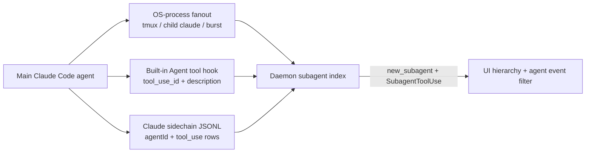

# Sub-Agent Detection Phase 1 Notes

Date: 2026-06-03

Scope: Claude Code CLI sub-agent feasibility. These notes use temporary daemon logging added under the `[SUBAGENT?]` and `[SUBAGENT-DELEGATION]` prefixes.

Current implementation note: AgentSnitch now has three sub-agent paths. OS-process detection still covers new Claude CLI processes discovered through tmux ancestry, Claude ancestry, hook lineage, session cwd, and bursts. Claude Code's built-in parallel `Agent` tool path may not spawn another `claude` process; for that case the daemon emits hook-inferred sub-agent lifecycle records keyed by the `Agent` tool's `tool_use_id`, named from `input_summary.description`, tagged with the hook PID, and shown under `Claude Code (subagents)` in the UI. The daemon also indexes Claude Code sidechain transcripts under `.claude/projects/<session>/subagents/*.jsonl`; those records carry Claude's `agentId` and later tool-use IDs, so AgentSnitch can recover subagent identity, surface sidechain tool-use rows as subagent activity, and attribute subsequent hook events after daemon restarts.



## Instrumentation

The daemon now tracks the original four feasibility signals:

- Known Claude CLI binary: process command resolves as Claude CLI, not Claude Desktop helper.
- Tmux ancestry: a Claude CLI process has `tmux` in its ancestor chain.
- Hook delegation pattern: recent semantic hook input mentions `tmux`, `claude `, `new claude`, `spawn claude`, `another claude`, `sub-agent`, or `sub agent`.
- Timing and cwd overlap: a new Claude CLI process appears within 30 seconds of a delegation-looking hook in the same cwd.

It also tracks non-tmux fanout signals:

- Claude ancestry: a new Claude CLI process has another Claude CLI process in its ancestor chain.
- Hook lineage: a new Claude CLI process descends from a recent Claude Code hook PID or PPID in the same cwd, even when the hook text did not contain a delegation keyword.
- Session cwd: a recent Claude Code hook establishes an active session cwd for corroborating direct ancestry, hook lineage, or burst signals.
- Burst: three or more new Claude CLI processes appear in the same cwd within 15 seconds. Burst summaries are logged with the `[SUBAGENT-BURST?]` prefix.
- Hook-inferred Claude `Agent` tool launch: a semantic event with `tool` set to `Agent` creates a child sub-agent even if no extra Claude CLI PID appears. The child agent uses `spawn_method=hook`, `pid=<hook pid>`, `version=<subagent_type>`, and a stable `subhook_<tool_use_id>` id.
- Claude sidechain transcript: when hook payloads reference a Claude transcript, the daemon indexes the parent transcript and sibling `subagents/*.jsonl` files. Each sidechain `agentId` becomes a stable `subchain_<agentId>` lifecycle record. Sidechain tool-use rows become `SubagentToolUse` semantic activity attributed to that subagent, sidechain tool-use IDs are mapped back to that subagent, and the UI shows the latest observed hook PID when there is no durable OS subagent PID.

Candidate log shape:

```text
[SUBAGENT?] pid=<pid> ppid=<ppid> cwd=<cwd> method=tmux|hook|claude_ancestor|hook_lineage|session_cwd|burst tmux_ancestor=<bool> claude_ancestor=<bool> recent_hook=<bool> hook_tool=<tool> hook_pattern=<pattern> hook_age=<duration> hook_cwd=<cwd> direct_child_of_hook=<bool> hook_lineage=<bool> recent_session=<bool> session_pid=<pid> session_age=<duration> burst_count=<n> baseline=false command="<command>"
```

Burst log shape:

```text
[SUBAGENT-BURST?] cwd=<cwd> count=<n> window=15s pids=<pid,pid,...> recent_session=<bool> session_pid=<pid> session_tool=<tool>
```

Hook-inferred lifecycle shape:

```json
{"schema":"agentsnitch.agent.v0","event":"new_subagent","agent":{"id":"subhook_<tool_use_id>","type":"sub","name":"<Agent description>","pid":<hook_pid>,"parent_agent_id":"main_<pid>","spawn_method":"hook","version":"<subagent_type>"}}
```

Sidechain lifecycle shape:

```json
{"schema":"agentsnitch.agent.v0","event":"new_subagent","agent":{"id":"subchain_<agentId>","type":"sub","name":"<scope-derived name>","pid":<latest_hook_pid>,"parent_agent_id":"main_<pid>","spawn_method":"claude_sidechain","version":"<agentId>"}}
```

Sidechain activity shape:

```json
{"schema":"agentsnitch.semantic.v0","event":"SubagentToolUse","tool":"<tool_use name>","target":"<best-effort target>","tool_use_id":"<sidechain tool_use id>","tags":["claude_sidechain","subagent_activity"],"agent":{"id":"subchain_<agentId>","type":"sub","name":"<scope-derived name>","parent_agent_id":"main_<pid>","spawn_method":"claude_sidechain","version":"<agentId>"}}
```

## Scenario Results

| # | Scenario | Result | Notes |
|---|----------|--------|-------|
| 1 | User manually spawns sub-agent via tmux | Detected | New `claude` process was not a baseline process and had tmux ancestry. |
| 2 | Claude Code tool call triggers tmux + claude | Detected | Synthetic real semantic event for `Bash` delegation plus tmux launch produced both delegation and candidate logs. |
| 3 | Multiple Claude Code instances in same workspace | Detected | Two concurrent tmux-launched Claude CLI processes were logged with matching cwd. Recent hook timing also matched because the earlier delegation hook was still within 30 seconds. |
| 4 | Sub-agent also has hooks installed | Detected | A tmux-launched `claude -p` emitted real PreToolUse/PostToolUse hook events to the temp daemon when `AGENTSNITCH_SOCK` was inherited. Hook PPID was the sub-agent PID. |
| 5 | Sub-agent has no hooks | Partially covered | Scenario 1 is process-only from AgentSnitch's perspective: no sub-agent hook was emitted, but tmux ancestry + cwd were enough to flag it. |
| 6 | Claude Code uses built-in parallel `Agent` tool | Detected by hook and sidechain | The hook stream includes `tool:"Agent"`, `tool_use_id`, `input_summary.description`, and `subagent_type`. Claude also writes sidechain JSONL files with `agentId` and later tool-use IDs. No separate Claude CLI PID is required. |

## Log Excerpts

Scenario 1, manual tmux launch:

```text
2026/06/03 12:30:25 [SUBAGENT?] pid=57533 ppid=57532 cwd=/Users/scottmoore/github/agentsnitch method=tmux tmux_ancestor=true recent_hook=false hook_tool= hook_pattern= hook_age= hook_cwd= direct_child_of_hook=false baseline=false command="claude"
```

Scenario 2, delegation hook followed by tmux launch:

```text
2026/06/03 12:30:46 SEMANTIC: 17:30:46.000 [Claude Code] PreToolUse Bash tmux new-session -d claude tags=[external_egress_attempt] pid=58184 cwd=/Users/scottmoore/github/agentsnitch
2026/06/03 12:30:46 [SUBAGENT-DELEGATION] pid=58184 ppid=7570 cwd=/Users/scottmoore/github/agentsnitch tool=Bash pattern=tmux
2026/06/03 12:30:49 [SUBAGENT?] pid=58232 ppid=58228 cwd=/Users/scottmoore/github/agentsnitch method=tmux|hook tmux_ancestor=true recent_hook=true hook_tool=Bash hook_pattern=tmux hook_age=3s hook_cwd=/Users/scottmoore/github/agentsnitch direct_child_of_hook=false baseline=false command="claude"
```

Scenario 3, multiple tmux-launched Claude CLI processes in the same workspace:

```text
2026/06/03 12:31:09 [SUBAGENT?] pid=58866 ppid=58863 cwd=/Users/scottmoore/github/agentsnitch method=tmux|hook tmux_ancestor=true recent_hook=true hook_tool=Bash hook_pattern=tmux hook_age=23s hook_cwd=/Users/scottmoore/github/agentsnitch direct_child_of_hook=false baseline=false command="claude"
2026/06/03 12:31:09 [SUBAGENT?] pid=58864 ppid=58863 cwd=/Users/scottmoore/github/agentsnitch method=tmux|hook tmux_ancestor=true recent_hook=true hook_tool=Bash hook_pattern=tmux hook_age=23s hook_cwd=/Users/scottmoore/github/agentsnitch direct_child_of_hook=false baseline=false command="claude"
```

Scenario 4, tmux-launched Claude with hooks:

```text
2026/06/03 12:31:39 [SUBAGENT?] pid=60254 ppid=60253 cwd=/Users/scottmoore/github/agentsnitch method=tmux tmux_ancestor=true recent_hook=false hook_tool= hook_pattern= hook_age= hook_cwd= direct_child_of_hook=false baseline=false command="claude -p --dangerously-skip-permissions Use Bash to run pwd and then stop."
2026/06/03 12:31:46 SEMANTIC: 17:31:46.045 [Claude Code] PreToolUse Bash pid=60670 cwd=/Users/scottmoore/github/agentsnitch
2026/06/03 12:31:46 SEMANTIC: 17:31:46.148 [Claude Code] PostToolUse Bash pid=60724 cwd=/Users/scottmoore/github/agentsnitch
```

## Noise Notes

- A tmux session running `zsh` produced no `[SUBAGENT?]` logs.
- Claude Desktop helper processes were not flagged because the detector requires Claude CLI classification.
- Timing + cwd overlap alone is noisy: scenario 3 inherited the earlier delegation hook match because it was still within the 30-second window. This is useful context but should not be treated as proof of causation without tmux ancestry, direct process relationship, or the sub-agent's own hooks.

## Initial Conclusions

- Reliable signal to build on: Claude CLI process with tmux ancestry.
- Strongest combined signal: delegation-looking hook followed by a new Claude CLI process with matching cwd and tmux ancestry.
- Non-tmux fanout coverage: direct Claude ancestry, hook-lineage ancestry, and same-cwd bursts let the daemon flag likely sub-agents even when `tmux` is not involved.
- Phase 2 structured records now use `agentsnitch.agent.v0` lifecycle events. Real process fanout records carry the discovered Claude CLI PID; hook-inferred `Agent` tool records carry the hook PID and the hook-inferred display name; sidechain records carry Claude's `agentId` and the latest hook PID when macOS has no durable child process to report.
- Main risk: timing + cwd overlap can over-associate separate tmux launches that happen near a delegation hook.
