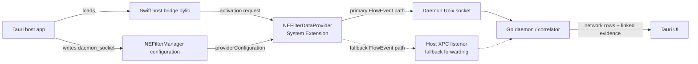

# AgentSnitch macOS Network Extension Integration

**Current policy:** This file includes historical Network Extension research, but the shipped AgentSnitch design is stricter than several older notes below. The Network Sensor is opt-in, uses `NEFilterDataProvider` only, remains metadata-only and fail-open, and must not include transparent proxy, app proxy, packet tunnel, DNS proxy, byte-forwarding, blocking, drop, remote egress, inbound listener, or root-daemon behavior.

**Network Extension (Opt-In Ground Truth)**

This document captures the current optional Network Extension implementation plus the build/signing research needed to distribute it inside a Tauri 2 macOS application bundle.

**References (from architecture.md and prd.md):**
- §3.2 Network Extension (Ground Truth)
- §5 IPC (XPC)
- §6 Installation & Packaging
- Limitations section
- Data model: Network Flow Event (see below)
- "The System Extension lives inside (or is bundled with) the Tauri application bundle."
- "Communication from extension to the daemon is direct Unix socket forwarding, with XPC retained for activation/configuration and fallback forwarding"
- Provider choice validated for the pre-alpha: `NEFilterDataProvider`

**Status:** Pre-alpha implementation. The default shipped path is semantic hooks plus unprivileged daemon-side NetworkStatistics/`nettop` process-network correlation, with `lsof` as fallback. The optional Network Sensor defines the `FlowEvent` contract, emits metadata-only records from `NEFilterDataProvider` when explicitly enabled, preserves `remoteHostname` as a best-effort destination display hint when macOS exposes it, and forwards real flow records directly from the extension to the daemon Unix socket configured through `NEFilterManager.providerConfiguration`. The Tauri app dynamically loads the Swift host bridge dylib for System Extension activation/configuration and keeps XPC available as a fallback flow forwarding path. The `make create` path builds, installs, signs, notarizes when credentials are available, registers hooks, starts the LaunchAgent daemon, launches the app, and runs `doctor`. Broader distribution still requires valid Apple Developer ID signing, host and extension provisioning profiles, notarization, and user/system approval on each machine.

Signing and notarization work must never commit private keys, `.p12` exports, provisioning profiles, certificate material, keychains, Apple credentials, notarytool JSON, local logs, or generated `.app`/`.systemextension` bundles. Keep those artifacts outside the repo and rely on environment variables or local keychain state for packaging.

## Current Data Path



## Current Implementation Summary

- `extension/AgentSnitchNetworkExtension.swift` is the provider. It is sensor-only and returns allow/pass verdicts.
- `extension/Info.plist` declares `com.somoore.agentsnitch.network-extension` as a filter-data System Extension.
- `extension/main.swift` provides the executable entrypoint for the manually built `.systemextension`.
- `extension/build-extension.sh` builds the extension executable and `libAgentSnitchHostBridge.dylib`.
- `scripts/package-macos-dev.sh` embeds the extension and host bridge into `/Applications/AgentSnitch.app` and signs either ad hoc for local UI inspection or with a real Developer ID identity/profiles for activation testing.
- `ui/src-tauri/src/lib.rs` starts the bridge, requests extension activation, saves the filter configuration, and forwards daemon/UI events.
- The daemon treats `observer: "network_statistics"` as the default production network observer, `observer: "lsof"` as fallback, and `observer: "network_extension"` only when the user opts into the Network Sensor.

## 1. High-Level Requirements for Embedding NE in Tauri 2 on macOS 13+

### 1.1 Required Entitlements

**Main App (containing bundle, e.g. AgentSnitch.app):**
- `com.apple.developer.system-extension.install` = true (to call OSSystemExtensionRequest)
- `com.apple.developer.networking.networkextension` = array of provider types (use -systemextension suffix for Developer ID / notarized distribution outside App Store)
  - Required and only shipped value: `content-filter-provider-systemextension`
  - Do not add app proxy, transparent proxy, packet tunnel, or DNS proxy provider types.
- `com.apple.security.app-sandbox` ? Often false for NE host apps that need broad access, or true with network.client etc. (see conflicts below)
- `com.apple.security.network.client` / server as needed for Tauri itself
- Hardened Runtime enabled (required for notarization and NE)

**Extension Target (the .systemextension bundle):**
- `com.apple.developer.networking.networkextension` = matching specific e.g. `["content-filter-provider-systemextension"]`
- The extension executable also inherits signing requirements.

**Example entitlements.plist for main app (place in ui/src-tauri/):**

```xml
<?xml version="1.0" encoding="UTF-8"?>
<!DOCTYPE plist PUBLIC "-//Apple//DTD PLIST 1.0//EN" "http://www.apple.com/DTDs/PropertyList-1.0.dtd">
<plist version="1.0">
<dict>
    <!-- Required to install/activate the System Extension -->
    <key>com.apple.developer.system-extension.install</key>
    <true/>

    <!-- Network Extension capability. For Developer ID + notarization (recommended for this app), use the -systemextension variants.
         The provisioning profile from Apple will list the allowed values (often a superset).
         AgentSnitch ships content-filter only. Do not add proxy/tunnel provider entitlements.
    -->
    <key>com.apple.developer.networking.networkextension</key>
    <array>
        <string>content-filter-provider-systemextension</string>
    </array>

    <!-- Tauri / app basics (adjust for sandbox if desired; many NE hosts run unsandboxed or with specific exceptions) -->
    <key>com.apple.security.app-sandbox</key>
    <false/> <!-- Common for tools needing broad FS/network; set true + exceptions if sandboxing the host -->
    <key>com.apple.security.network.client</key>
    <true/>
    <key>com.apple.security.network.server</key>
    <true/>

    <!-- If using XPC or other -->
    <key>com.apple.security.temporary-exception.shared-preference.read-write</key>
    <array>
        <!-- if needed for prefs -->
    </array>
</dict>
</plist>
```

**Example entitlements for the extension target (e.g. extension/AgentSnitchNetworkExtension.entitlements):**

```xml
<?xml version="1.0" encoding="UTF-8"?>
<!DOCTYPE plist PUBLIC "-//Apple//DTD PLIST 1.0//EN" "http://www.apple.com/DTDs/PropertyList-1.0.dtd">
<plist version="1.0">
<dict>
    <key>com.apple.developer.networking.networkextension</key>
    <array>
        <string>content-filter-provider-systemextension</string>
    </array>
    <!-- Extension usually does not need system-extension.install; the host does -->
    <!-- No app-sandbox by default for the extension process in many cases, or minimal -->
</dict>
</plist>
```

**Notes on entitlements gotchas (from forums + Apple docs):**
- For Developer ID profiles, Apple often only includes the `-systemextension` suffixed values in the profile's entitlements. Using the legacy `content-filter-provider` (without suffix) will cause "provisioning profile doesn't match the entitlements" at build/sign time.
- You enable "Network Extensions" capability in the App ID in developer portal; this populates the profile.
- The array in your .entitlements must be a subset (or exact match in some Xcode validations) of what the profile allows.
- Separate provisioning profiles may be needed for the main app target vs. the extension target (common pattern).
- `com.apple.developer.system-extension.install` on the *host app only*.
- For App Store distribution: different (use non-systemextension variants + App Sandbox required).
- Hardened runtime + notarization required for distribution outside MAS. The NE will not load otherwise in most cases.
- MDM: System Extensions can be pre-approved via MDM profiles (com.apple.system-extension-policy or specific), but user approval flow still often surfaces in Privacy & Security on first use. Corporate devices may block user-approved extensions.

**Also add to the app's Info.plist (via tauri.conf "macOS.infoPlist" or separate Info.plist merge):**

```xml
<key>NSSystemExtensionUsageDescription</key>
<string>AgentSnitch uses a Network Extension to observe network flows from AI coding agents with process attribution for security visibility and correlation with tool activity.</string>
```

This string is shown to the user during the System Extension approval prompt.

### 1.2 Bundle Layout

The final .app must contain:

```
AgentSnitch.app/
  Contents/
    MacOS/
      AgentSnitch   (the Tauri/Rust binary)
    Library/
      SystemExtensions/
        com.somoore.agentsnitch.network-extension.systemextension/   <--- exact match to the extension's CFBundleIdentifier + ".systemextension"
          Contents/
            MacOS/
              AgentSnitchNetworkExtension   (the Swift/ObjC executable for the provider)
            Info.plist
            _CodeSignature/
              ...
    Resources/
      ...
    Frameworks/ (if any)
    Info.plist   (main app, with NSExtension? no, the sub-bundle has it)
    embedded.provisionprofile (if using)
    ...
```

**Critical naming rule (Apple):**
- The directory name inside SystemExtensions/ **must** be `<extension-bundle-id>.systemextension`
- The extension's `CFBundleIdentifier` in *its* Info.plist must match what you request in `OSSystemExtensionRequest` (e.g. `com.somoore.agentsnitch.network-extension`)
- The main app's identifier is `com.somoore.agentsnitch`
- Signing: same Team ID (or redistributable entitlement for the extension).

Tauri by default does **not** know about this layout. You must use:
- `bundle.macOS.files` in tauri.conf.json (maps source -> destination under Contents/)
- Or (preferred for complex): a `beforeBundleCommand` or `afterBundleCommand` (check current Tauri version support; in v2 it's `beforeBundleCommand` in some contexts, or use external script invoked from npm/pnpm script before `tauri build`).
- Custom packaging script that:
  1. Runs `cargo tauri build --config ...` (or the JS equivalent) to produce a .app (perhaps unsigned or with specific config).
  2. Builds the extension (xcodebuild).
  3. Copies the produced .systemextension into the .app/Contents/Library/SystemExtensions/ (creating dirs).
  4. Re-signs the entire bundle with the correct entitlements and identity (`codesign --force --deep --sign "Developer ID Application: ..." --entitlements ... --options runtime`).
  5. Notarizes if distributing.

See "Build notes" section below.

### 1.3 Activation & User / MDM Flow

In the host app (Tauri Rust side or a small launcher):

```swift
// Example (will be bridged or in a helper)
import SystemExtensions

let request = OSSystemExtensionRequest.activationRequest(
    forExtensionWithIdentifier: "com.somoore.agentsnitch.network-extension",
    queue: .main
)
request.delegate = self  // implement OSSystemExtensionRequestDelegate
OSSystemExtensionManager.shared.submitRequest(request)
```

Delegate methods:
- `request(_ request: OSSystemExtensionRequest, didFinishWithResult result: OSSystemExtensionRequest.Result)`
- `request(_ request: OSSystemExtensionRequest, didFailWithError error: Error)`
- `requestNeedsUserApproval(_ request: OSSystemExtensionRequest)`

On first activation (or after update), the system prompts in:
- System Settings > Privacy & Security > Security (or Login Items & Extensions > Network Extensions)
- User must "Allow" or "Open System Settings" to approve.

`systemextensionsctl list` shows state: `[activated enabled]`, teamID, bundleID, version, [state].

Dev workflow:
- `systemextensionsctl developer on` (allows loading from non-/Applications, unsigned in some cases, faster iteration). Turn off for prod-like testing.
- For Xcode dev: the extension can be embedded as a System Extension target in a companion .xcodeproj; Xcode handles staging.
- Reload: after rebuild, use `systemextensionsctl uninstall <team> <bundle>` then re-activate from app, or just replace and re-launch (sysextd handles updates).
- Logs: `log stream --predicate 'subsystem == "com.apple.system-extension" or category == "sysextd" or process == "nesessionmanager"' --level debug`

Uninstall: `systemextensionsctl uninstall <teamID> com.somoore.agentsnitch.network-extension` (teamID can be - for empty).

**MDM implications:**
- Can push `com.apple.system-extension-policy` payload to allow specific extensions by team/bundle without user prompt (or pre-approve).
- Still visible in System Settings.
- Some orgs lock down "User Approved" extensions entirely.
- For AgentSnitch, document that in enterprise, the value (correlated visibility) must be sold to IT, or provide MDM profile snippet.

### 1.4 Signing and Notarization

- Developer ID Application cert (not just "Apple Development" for distribution; dev certs for local).
- Hardened Runtime (`--options runtime`).
- Specific entitlements as above.
- Notarize the .app (or .dmg/pkg containing it) with `xcrun notarytool submit ... --wait`.
- Staple.
- Keep signing identities, provisioning profiles, certificate exports, notary credentials, and per-machine entitlement overrides out of git. `.gitignore` covers common extensions, but reviewers should still scan before pushing packaging changes.
- Tauri has built-in support: set `bundle.macOS.signingIdentity` or env `TAURI_SIGNING_IDENTITY`, and `tauri.conf` has hooks for it. See https://v2.tauri.app/distribute/sign/macos/
- **Conflicts with Tauri code signing:**
  - Tauri 's bundler (tauri-bundler) runs `codesign` on the produced .app after copying resources/frameworks.
  - If you embed the .systemextension *before* Tauri's sign step (via files or beforeBundle), Tauri may sign it (good if using same identity).
  - If after, you must re-sign the whole thing yourself, including the inner extension (use `--deep` or sign inner first then outer).
  - Best: configure Tauri for "sign" but produce the bundle with extension already in place (custom script orchestrates xcodebuild of ext + tauri build + copy + final sign/notarize).
  - Ad-hoc signing (`-`) works for local dev with `systemextensionsctl developer on`, but NE may have restrictions.
  - The extension's bundle must be signed with the *same* cert/team as the host (or redistributable).
  - Provisioning profiles: for the extension target in Xcode, use a Developer ID profile that includes the Network Extensions capability.
  - Common error: "Signature check failed: code failed to satisfy specified code requirement(s)" from nesessionmanager — usually entitlements/profile mismatch or hardened runtime missing or wrong designated requirement.

Tauri config example addition (see updates section):

```json
"bundle": {
  ...
  "macOS": {
    "entitlements": "entitlements.plist",
    "minimumSystemVersion": "13.0",
    "hardenedRuntime": true,
    "signingIdentity": "Developer ID Application: Your Name (TEAMID)",  // or leave for env/CLI
    "infoPlist": {
      "NSSystemExtensionUsageDescription": "AgentSnitch uses a Network Extension..."
    },
    "files": {
      // Placeholder example; real use requires the .systemextension to exist at build time relative to this.
      // "Library/SystemExtensions/com.somoore.agentsnitch.network-extension.systemextension": "../extension/build/AgentSnitchNetworkExtension.systemextension"
    }
  }
}
```

`files` copies from source path (relative to tauri.conf or project) to destination under Contents/.

For complex embedding of a whole signed bundle, a script is almost always required.

### 1.5 Communication: Direct Socket + XPC

The pre-alpha data path sends flow records directly from the Network Extension to the daemon Unix socket. The host app writes that socket path into `NEFilterManager.providerConfiguration["daemon_socket"]` before saving the filter configuration. This keeps network telemetry flowing even when the UI process is only acting as activation/configuration host.

XPC remains useful and implemented for Apple-native host/extension communication:

- The host bridge starts an `NSXPCListener`.
- The Tauri app uses the bridge to submit `OSSystemExtensionRequest` activation.
- The extension can fall back to the host XPC listener if the direct daemon socket is unavailable.
- Future bidirectional configuration can use XPC for quiet lists or flow-shaping controls.

**In the Extension (Swift):**
- In `startProxy` / `startFilter` (or `init`), set up an XPC listener or use `NEProvider` 's built-in? Actually, common is to use a Mach service name registered via the extension's Info.plist under NetworkExtension/NEMachServiceName, or direct NSXPCConnection from extension to host (host must publish the service).
- Host app (Tauri) listens on a named XPC service (using `xpc_connection_create_mach_service` or NSXPCListener with mach name).
- Extension connects outbound to the host's service name (the host bundle ID or a derived name).

Fallback XPC flow:
1. Host app launches, registers XPC listener for e.g. `com.somoore.agentsnitch.xpc` or uses the NE-specific.
2. Host submits activation request for the extension.
3. Extension starts (as system extension, runs even if host quits in some cases, but usually tied).
4. Extension creates `NSXPCConnection` to the host service and sends FlowEvents if direct daemon socket forwarding fails.
5. Host receives, forwards to daemon over the AgentSnitch Unix domain socket.

**Current readiness checker:**
- `make ne-ready` runs `cmd/neready`.
- It validates the source plist/entitlement contract, then inspects `/Applications/AgentSnitch.app`.
- It should fail until the installed app is signed with a real Apple Team ID, has the required signed entitlements, embeds `Contents/Library/SystemExtensions/com.somoore.agentsnitch.network-extension.systemextension`, embeds `Contents/Frameworks/libAgentSnitchHostBridge.dylib`, and `systemextensionsctl list` shows the extension activated/listed.
- A warning for `$(PRODUCT_MODULE_NAME)` in `NSExtensionPrincipalClass` means the source plist is still a template. Xcode substitution is acceptable during a real extension build; otherwise make the class name concrete in the produced bundle.

**Current host bridge implementation:**
- `extension/AgentSnitchXPCProtocol.swift` defines the shared XPC service name, extension bundle id, and `handleFlowEvent(_:withReply:)` protocol.
- `extension/AgentSnitchHostBridge.swift` contains the host-side `OSSystemExtensionRequest` activator, `NSXPCListener`, and Unix-socket forwarder into the Go daemon.
- `extension/AgentSnitchNetworkExtension.swift` forwards encoded metadata-only `FlowEvent` JSON to the daemon socket first and uses the XPC protocol as fallback. It emits `new` flow records from `handleNewFlow` by default, allows flows immediately, and leaves byte lifecycle callbacks disabled unless explicitly configured for debug/performance testing. Delivery is strictly off the flow-decision path: `handleNewFlow` returns `.allow()` synchronously and `send()` only encodes and enqueues; the blocking `connect`/`write` (bounded by a send timeout) runs on a serial background queue with a capped, drop-oldest backlog, so a slow or wedged daemon cannot stall a network verdict.
- `extension/build-extension.sh` also builds `extension/build/libAgentSnitchHostBridge.dylib` with C-callable `AgentSnitchHostBridgeStart`, `AgentSnitchHostBridgeActivateSystemExtension`, and `AgentSnitchHostBridgeSetNetworkSensorDisabled` exports.
- `ui/src-tauri/src/lib.rs` dynamically loads `libAgentSnitchHostBridge.dylib`, starts the XPC listener, persists app settings, and skips `OSSystemExtensionRequest` activation while the Network Sensor is disabled. During local development it logs and continues if the dylib is missing.
- `make ne-typecheck` type-checks the host bridge and Network Extension Swift sources. Passing type-check does not mean the extension is bundled, signed, or activated; it proves the scaffold compiles against the local macOS SDK.
- `make build-extension` produces `extension/build/com.somoore.agentsnitch.network-extension.systemextension` with a concrete principal class. It signs ad hoc by default (`AGENTSNITCH_EXT_SIGN_IDENTITY=-`); pass a real Apple signing identity once the provisioning profile exists.
- `make package-macos-dev` embeds the built `.systemextension` into `/Applications/AgentSnitch.app/Contents/Library/SystemExtensions/`, embeds `libAgentSnitchHostBridge.dylib` into `/Applications/AgentSnitch.app/Contents/Frameworks/`, and re-signs the inner extension, dylib, and outer app. It signs with launchable dev entitlements by default, or with restricted production entitlements when a real Developer ID identity plus host and extension provisioning profiles are supplied.
- `make ne-ready` / `./bin/neready` checks the source, built extension, and embedded extension for direct daemon socket forwarding, the XPC fallback path, NEFilterManager binding, metadata-only defaults, opt-in settings defaults, payload/config caps, content-filter-only entitlements, provisioning profiles, and static absence of remote egress/proxy APIs.
- By default, the outer app is signed with `ui/src-tauri/dev-entitlements.plist`, not the restricted production entitlement plist. This keeps the local UI launchable. macOS AMFI kills ad hoc apps that carry restricted System Extension / Network Extension entitlements because there is no certificate chain to validate them. The dev plist also disables library validation so the ad hoc app can load the ad hoc Swift host bridge dylib; production should instead sign the app and dylib with the same real Team ID.
- To inspect production entitlement signing with real profiles, run `AGENTSNITCH_APP_SIGN_IDENTITY="Developer ID Application: ..." AGENTSNITCH_HOST_PROFILE=/path/to/host.provisionprofile AGENTSNITCH_EXTENSION_PROFILE=/path/to/extension.provisionprofile make package-macos-dev`. Without that real signing/provisioning and user/system approval, the extension still cannot activate.

**Options for Rust side (Tauri / daemon):**
- **Easiest for skeleton:** Create a small Swift dylib or helper binary that the Rust calls via `swift-rs` or `objc2` + FFI to handle XPC listener and deserialization. The helper can be bundled as a framework or resource.
- **Pure Rust:** Use crates like:
  - `rama-net-apple-xpc` (from rama project — specifically built for NE + XPC bridging; see their tproxy example).
  - Lower level: `xpc` crate, `mach2`, or implement via `libc` + `xpc_*` functions (complex, unsafe).
  - `objc2` + `block2` to call into Foundation XPC APIs from Rust (possible, since Tauri already pulls objc2 for macOS).
- **Go daemon side:** If daemon stays in Go, it can also speak XPC via cgo or a small bridge, but since Tauri is the "app", prefer the UI process hosts the XPC endpoint and proxies events to the daemon over the existing Unix domain socket channel.
- Bidirectional XPC possible if extension needs config updates from daemon (e.g. "quiet this host").

**XPC message shape recommendation:**
Use XPC dictionaries (or archived data). For simplicity in the pre-alpha, send a plist-compatible dict or JSON data blob.

Define a stable `FlowEvent` (matches the network flow event in architecture.md plus extras for correlation).

See skeleton code below for the struct.

The daemon (Go) accepts this JSON shape on its Unix socket. The extension sends it directly when the daemon socket is configured; the host XPC endpoint forwards the same shape if it receives `FlowEvent` data from the extension as fallback. Network Extension events set `"observer": "network_extension"`; the default userland observer sets `"observer": "network_statistics"`; the `lsof` fallback sets `"observer": "lsof"` so doctor/UI can distinguish the source. Development network visibility should come from real OS observation, not fabricated flow injection.

### 1.6 Attribution Details (PID, Signing, SNI, Byte Counts)

**Primary source:**
- For **NEFilterDataProvider / NEFilterFlow**: prefer `flow.sourceProcessAuditToken` on macOS 13+ because it names the process that created the flow; fall back to `flow.sourceAppAuditToken` when process attribution is unavailable. Related app metadata includes `sourceAppIdentifier` and `sourceAppVersion` where available.

**Convert audit token to PID (C/Swift):**
```c
#include <bsm/libbsm.h>
audit_token_t token;
pid_t pid = audit_token_to_pid(token);
```

In Swift (import Darwin or use bridging):
```swift
let tokenData = ... as Data
let auditToken = tokenData.withUnsafeBytes { $0.bindMemory(to: audit_token_t.self).baseAddress!.pointee }
let pid = audit_token_to_pid(auditToken)
```

**Signing info / path:**
```swift
var code: SecCode?
let attrs: [String: Any] = [kSecGuestAttributeAudit as String: tokenData]
SecCodeCopyGuestWithAttributes(nil, attrs as CFDictionary, [], &code)
if let code {
    var path: CFURL?
    SecCodeCopyPath(code, [], &path)
    // also SecCodeCopySigningInformation for team, identifier, etc.
}
```

**SNI:**
- In many flows, `remoteHostname` is available from `NEFilterSocketFlow`. AgentSnitch stores a sanitized host-like `remoteHostname` value in the flow's `sni` field as a destination display hint. This is not proof that TLS SNI was parsed.
- Do not parse TLS handshakes or peek bytes in the shipped Network Sensor path. Limitations remain ECH (Encrypted Client Hello), no SNI, IP-only connects, QUIC early data, and hostnames that macOS does not expose.

**Byte counts / lifecycle:**
- Byte callbacks are disabled by default. Do not enable `filterDataVerdict` byte peeking in distribution builds.
- Events: metadata-only new flow records by default. Lifecycle/byte accounting needs a separate performance and security review before shipping.
- Direction: inbound/outbound relative to the host.

**Process tree / ancestry:**
NE gives you the *direct* source PID for the socket. The daemon (correlator) is responsible for building the agent process tree (seeded by hook emitter PIDs + kqueue / libproc snapshots of children / ppid).

**Limitations of NE (honest, from ARCH + research):**
- No visibility into payload content for TLS (by design; we avoid MITM in MVP).
- Attribution can be empty for some apps (e.g. Firefox on recent macOS per forums; sandboxed or TCC processes).
- Long-lived connections: a flow started "clean" can carry exfil later. Time-based correlation + re-validation signals help.
- Rules for what flows you see: keep content-filter scope broad enough for attribution while staying fail-open and metadata-only.
- For content filter, you see flows matching your config; can be broad.
- Performance: NE runs with high privilege; keep code minimal, no heavy parsing in hot path.
- Only one active content-filter or certain NE types at a time in some categories (e.g. DNS proxy is singular).
- Updates to the extension require re-activation / user re-approval in some cases.
- Debug: unified logging + Console.app; `log` predicate for `nesessionmanager`, `sysextd`, your subsystem.

**Required provider type for the shipped product:**
- **Use NEFilterDataProvider only** (`content-filter-provider-systemextension`). It is sufficient for opt-in attribution and lets the provider return allow/pass verdicts without forwarding user bytes.
- Do not add `NETransparentProxyProvider`, `NEAppProxyProvider`, packet tunnel, DNS proxy, or hybrid provider registrations to AgentSnitch distribution builds.
- Do not evolve this sensor into shaping, redirecting, dropping, or proxying. Any future enforcement product should be designed as a separate threat model and entitlement set.
- Why not packet-tunnel: Lacks per-app attribution (sourceAppAuditToken often nil); it's for full IP tunneling/VPN, not process-aware observation.

See skeleton for NEFilterDataProvider example (easier logging).

## 2. Skeleton Code

### extension/AgentSnitchNetworkExtension.swift (minimal logging + XPC stub)

```swift
/*
 * AgentSnitchNetworkExtension.swift
 * Minimal skeleton for NEFilterDataProvider.
 * Logs flows with PID attribution, signing, endpoints. Sends FlowEvent via XPC stub.
 *
 * Build as part of a System Extension target (see integration.md notes).
 * This file would live in an Xcode project or be compiled via xcodebuild from the extension/ dir.
 */

import Foundation
import NetworkExtension
import os.log  // or unified logging

// MARK: - FlowEvent (matches architecture + daemon expectations)
// This shape should be kept in sync with the Go NetworkFlowEvent / JSON in the daemon.
// Use Codable for easy JSON roundtrip if sending over XPC as Data, or map to NSDictionary for native XPC.

struct FlowEvent: Codable {
    let schema: String
    let ts: String
    let flow_id: String
    let pid: Int
    let ppid: Int?          // daemon will enrich if possible
    let process_path: String?
    let process_bundle_id: String?
    let process_team_id: String?
    let signing_info: SigningInfo?
    let local: String?
    let remote: String
    let sni: String?
    let protocol: String    // "tcp" | "udp"
    let direction: String   // "out" | "in"
    let bytes_out: Int
    let bytes_in: Int
    let state: String       // "new" | "established" | "closed" etc.

    struct SigningInfo: Codable {
        let team: String?
        let identifier: String?
        let path: String?
    }
}

// Example XPC service name (host app must publish this or a mach service)
private let kXPCServiceName = "com.somoore.agentsnitch.xpc"  // or derive from bundle

// Simple XPC sender stub (replace with real bidirectional connection + error handling)
class XPCEventSender {
    private var connection: NSXPCConnection?

    func connect() {
        // For outbound from extension to host-published service:
        connection = NSXPCConnection(machServiceName: kXPCServiceName, options: [])
        // Set up exported interfaces if bidirectional
        connection?.resume()
        // In real impl: set remoteObjectInterface for a protocol the host implements.
    }

    func send(_ event: FlowEvent) {
        guard let conn = connection else {
            // Fallback: log only
            logEvent(event)
            return
        }
        // For simplicity, send as JSON Data via a generic "sendEvent" selector or define @objc protocol.
        // Real: define a protocol like @objc protocol AgentSnitchXPC { func handleFlowEvent(_ data: Data) }
        if let data = try? JSONEncoder().encode(event) {
            // conn.remoteObjectProxy.handleFlowEvent(data) or similar
            os_log("XPC stub: would send FlowEvent bytes=%d", data.count)
        }
        logEvent(event)  // always log for dev
    }

    private func logEvent(_ event: FlowEvent) {
        let logger = Logger(subsystem: "com.somoore.agentsnitch.network-extension", category: "flows")
        logger.info("FlowEvent pid=\(event.pid) remote=\(event.remote) sni=\(event.sni ?? "-") path=\(event.process_path ?? "-")")
        // Or use os_log for older.
    }
}

// MARK: - Provider

class AgentSnitchNetworkExtension: NEFilterDataProvider {

    private let sender = XPCEventSender()
    private var flowCounter: Int = 0

    override func startFilter(completionHandler: @escaping (Error?) -> Void) {
        os_log("AgentSnitchNetworkExtension starting (filter data provider)")
        sender.connect()

        // For content filter, you often configure via NEFilterManager in the host app.
        // Here we assume the host has already installed a configuration that routes traffic to us.
        // For broad observation, the config can use "filter packets" or socket filter flags.

        completionHandler(nil)
    }

    override func stopFilter(with reason: NEProviderStopReason, completionHandler: @escaping () -> Void) {
        os_log("AgentSnitchNetworkExtension stopping: %@", reason.rawValue)
        completionHandler()
    }

    // Core observation point. Always allow for sensor (never gate).
    override func handleNewFlow(_ flow: NEFilterFlow) -> NEFilterNewFlowVerdict {
        flowCounter += 1
        let flowID = "ne-\(flowCounter)-\(UUID().uuidString.prefix(8))"

        var pid: pid_t = -1
        var processPath: String?
        var signingTeam: String?
        var signingID: String?
        var remoteDesc = "unknown"
        var localDesc: String?
        var sni: String?
        let proto = "tcp"  // or inspect flow
        let dir = "out"

        // Attribution (works for NEFilterFlow)
        if let auditData = flow.sourceAppAuditToken {
            let auditToken = auditData.withUnsafeBytes { ptr in
                ptr.bindMemory(to: audit_token_t.self).baseAddress!.pointee
            }
            pid = audit_token_to_pid(auditToken)

            // Signing / path via SecCode (or proc_pidpath_audittoken for path)
            var code: SecCode?
            let attrs = [kSecGuestAttributeAudit as String: auditData] as CFDictionary
            if SecCodeCopyGuestWithAttributes(nil, attrs, [], &code) == errSecSuccess, let code = code {
                var url: CFURL?
                SecCodeCopyPath(code, [], &url)
                processPath = (url as URL?)?.path

                // For more: SecCodeCopySigningInformation(code, [], &infoDict) for teamID, identifier etc.
                if let info = SecCodeCopySigningInformation(code, [], nil) as? [String: Any] {
                    signingTeam = info["teamid"] as? String
                    signingID = info[kSecCodeInfoIdentifier as String] as? String
                }
            }
        }

        // Endpoints: use metadata exposed by NEFilterSocketFlow. Do not switch to proxy providers in AgentSnitch builds.
        if let remote = flow.destinationAppEndpoint as? NWHostEndpoint {  // or similar on the flow
            remoteDesc = "\(remote.hostname ?? "ip"):\(remote.port ?? "?")"
        } else if let endpointDesc = flow.description {
            remoteDesc = endpointDesc  // fallback
        }

        // SNI: For filter, often available on certain flows or via inbound data peek.
        // Stub: in a real data handler you would parse ClientHello here.
        // sni = extractSNIFromInitialData(...)
        if let hostname = flow.sourceAppIdentifier {  // sometimes bundle, not SNI
            // placeholder
        }

        // Byte counts start at 0; updated via handle*Data callbacks in full impl.
        let event = FlowEvent(
            schema: "agentsnitch.network.v0",
            ts: ISO8601DateFormatter().string(from: Date()),
            flow_id: flowID,
            pid: Int(pid),
            ppid: nil,  // enriched by daemon from process tree
            process_path: processPath,
            process_bundle_id: signingID,
            process_team_id: signingTeam,
            signing_info: signingTeam != nil || signingID != nil || processPath != nil ? FlowEvent.SigningInfo(team: signingTeam, identifier: signingID, path: processPath) : nil,
            local: localDesc,
            remote: remoteDesc,
            sni: sni,
            protocol: proto,
            direction: dir,
            bytes_out: 0,
            bytes_in: 0,
            state: "new"
        )

        sender.send(event)

        // Sensor only: always allow.
        return .allow()
    }

    // Do not implement byte peeking, proxying, dropping, or redirecting in the shipped sensor.
}
```

### extension/AgentSnitchNetworkExtension.entitlements

(See XML example in section 1.1)

### extension/Info.plist (for the extension bundle)

```xml
<?xml version="1.0" encoding="UTF-8"?>
<!DOCTYPE plist PUBLIC "-//Apple//DTD PLIST 1.0//EN" "http://www.apple.com/DTDs/PropertyList-1.0.dtd">
<plist version="1.0">
<dict>
    <key>CFBundleIdentifier</key>
    <string>com.somoore.agentsnitch.network-extension</string>
    <key>CFBundleName</key>
    <string>AgentSnitchNetworkExtension</string>
    <key>CFBundleVersion</key>
    <string>0.1.0</string>
    <key>CFBundleShortVersionString</key>
    <string>0.1.0</string>
    <key>CFBundleExecutable</key>
    <string>AgentSnitchNetworkExtension</string>
    <key>CFBundlePackageType</key>
    <string>XPC!</string>  <!-- or BNDL for some, but system ext uses specific -->

    <key>NSExtension</key>
    <dict>
        <key>NSExtensionPointIdentifier</key>
        <string>com.apple.networkextension.filter-data</string>
        <key>NSExtensionPrincipalClass</key>
        <string>$(PRODUCT_MODULE_NAME).AgentSnitchNetworkExtension</string>
    </dict>

    <!-- Optional but common for NE system extensions -->
    <key>NetworkExtension</key>
    <dict>
        <key>NEProviderClasses</key>
        <dict>
            <key>com.apple.networkextension.filter-data</key>
            <string>AgentSnitchNetworkExtension</string>
        </dict>
        <!-- <key>NEMachServiceName</key> <string>com.somoore.agentsnitch.network-extension</string> -->
    </dict>
</dict>
</plist>
```

(Adjust for your module name; in Xcode this is templated.)

## 3. Build Notes & Tauri Integration

### 3.1 Recommended Structure for extension/

```
agentsnitch/
  extension/
    integration.md                 # this file
    entitlements.plist             # for extension target (or .entitlements)
    AgentSnitchNetworkExtension.swift
    Info.plist                     # the extension's
    AgentSnitchNetworkExtension.entitlements
    # Future:
    # AgentSnitchNetworkExtension.xcodeproj/   (or use xcodegen.yml)
    # build.sh                         # xcodebuild wrapper that produces the .systemextension
    # readme.md for the Xcode project
```

### 3.2 How to Build the Extension

**Preferred for iteration: Companion Xcode project**
1. In Xcode: File > New > Target > macOS > System Extension > Network Extension (or App Extension then convert).
2. Or add a target to a new .xcodeproj in the extension/ dir.
3. Set the target's bundle ID to `com.somoore.agentsnitch.network-extension`
4. Embed the target in the "host" app target (but since Tauri has no Xcode host, you'll build the extension product independently and copy the output .systemextension bundle).
5. Use Build Phases to copy the built extension to a known location (e.g. `build/AgentSnitchNetworkExtension.systemextension`).
6. For pure command-line: `xcodebuild -project extension/AgentSnitch.xcodeproj -target AgentSnitchNetworkExtension -configuration Release -sdk macosx build`

The output of a system extension target is a .systemextension bundle ready to embed.

**Alternative without full Xcode (advanced):**
- Use `xcodegen` + a minimal project spec.
- Or compile Swift manually + construct the bundle dir + codesign the executable with the extension entitlements + embed Info.plist.
- Fragile; not recommended for first spike.

### 3.3 Extending Tauri Build

In `ui/package.json` (or Makefile):

```json
"scripts": {
  "build:ext": "cd ../extension && ./build-extension.sh",  // produces ../ui/src-tauri/target/ or dist/ the .systemextension
  "tauri": "tauri",
  "build": "npm run build:web && npm run build:ext && cargo tauri build"
}
```

In `ui/src-tauri/tauri.conf.json` additions:

```json
{
  "bundle": {
    "macOS": {
      "entitlements": "entitlements.plist",
      "minimumSystemVersion": "13.0",
      "hardenedRuntime": true,
      "infoPlist": {
        "NSSystemExtensionUsageDescription": "..."
      },
      // "files" can point to a pre-built extension dir relative to src-tauri or ui/
      // "files": {
      //   "Library/SystemExtensions/com.somoore.agentsnitch.network-extension.systemextension": "path/to/built/systemextension"
      // },
      "frameworks": []  // add any dylibs if using swift-rs bridge etc.
    }
  },
  "build": {
    "beforeBundleCommand": "npm run build:ext"   // or absolute path to script; runs before packaging the .app
  }
}
```

Tauri v2 supports `beforeBundleCommand` (verify in your installed version; it may be under a different key or you invoke the full pipeline from a wrapper script).

**Custom packaging script pattern (recommended):**
- `scripts/package-macos.sh`:
  1. Build the extension (xcodebuild or script) → produces `extension/build/xxx.systemextension`
  2. `cd ui && pnpm tauri build --config '{"bundle":{"macOS":{"signingIdentity":null}}}' --debug` or similar to get an unsigned .app in target.
  3. Copy the .systemextension into the produced .app/Contents/Library/SystemExtensions/
  4. codesign the inner extension (if not already).
  5. codesign the whole .app with --deep, entitlements, hardened runtime, your identity.
  6. If releasing: notarize + staple.
- Then `tauri build` can be configured to skip some signing, or the script does the final artifact.

Also update root Makefile with `build-extension` target.

**Placeholder in Cargo.toml / build.rs for native support:**
Add to ui/src-tauri/Cargo.toml (under [dependencies] or a feature):

```toml
# Future: bridge to the Network Extension XPC or activation APIs.
# swift-rs = { version = "1", optional = true }  # for calling Swift from Rust
# objc2 = { version = "0.6", features = ["foundation", "system-extensions"] } # already indirect dep via tauri
```

Create `ui/src-tauri/build.rs` (standard for tauri):

```rust
fn main() {
    tauri_build::build();
    // Future: if using swift-rs, println!("cargo:rustc-link-lib=..."); or build the bridge.
}
```

In src/main.rs or lib.rs, add cfg-gated code for macOS activation and XPC setup (using objc2 or external crate).

Example stub (in main.rs setup):

```rust
#[cfg(target_os = "macos")]
fn activate_network_extension() {
    // Call into Swift helper or use objc2 to do OSSystemExtensionRequest.
    // For now: println!("TODO: activate NE via SystemExtensions framework");
}
```

### 3.4 Dev Workflow Commands (local)

```bash
# In extension/ (with Xcode project)
xcodebuild ...

# After tauri produces .app (or your package script)
systemextensionsctl developer on   # for local testing

# Launch the .app from /Applications or directly (for dev, from build dir with care)
open /path/to/AgentSnitch.app

# Monitor
log stream --predicate 'subsystem contains "agentsnitch" or process == "nesessionmanager"' -level debug

systemextensionsctl list

# To force re-activation after rebuild:
systemextensionsctl uninstall - com.somoore.agentsnitch.network-extension
# Then relaunch app, which re-requests activation.
```

For codesign testing without full cert: use ad-hoc and developer mode.

## 4. How to Proceed (for main agent / future coding subagents)

1. **Create the extension/ dir and files** from this integration.md (the skeletons + entitlements + Info.plist).
2. **Update ui/src-tauri/tauri.conf.json** (see "Updates to ui files" below; add the NSSystemExtensionUsageDescription, hardenedRuntime, etc. Commented placeholders for files/beforeBundleCommand).
3. **Add entitlements.plist** to ui/src-tauri/ (the main app one; the extension one lives in extension/).
4. **Add build.rs** to ui/src-tauri/ (standard tauri + future bridge).
5. **Add macOS activation stub** in the Tauri Rust setup (behind #[cfg(macos)]).
6. **Create a minimal Xcode project** (or xcodegen spec) in extension/ that builds the Swift + produces .systemextension. Or implement a build-extension.sh that does xcodebuild.
7. **Implement real XPC**:
   - Host side: register listener (objc2 or helper).
   - Define a small protocol for FlowEvent (or just Data/JSON).
   - Wire received events from XPC into the existing daemon Unix domain socket channel.
8. **In daemon (Go or Rust port):** accept the network flows, store in session model alongside semantic events, implement basic time+PID correlation.
9. **Test loop:**
   - Build everything.
   - `systemextensionsctl developer on`
   - Run a test agent (Claude Code) that does sensitive read + curl.
   - Watch logs + `systemextensionsctl list`
   - Approve in Privacy & Security if prompted.
   - See FlowEvents with real PIDs attributed to the agent tree.
10. **Later:** Add SNI extraction (reuse/port sir's extractSNI), byte counting, full lifecycle events, optional shaping rules.
11. **Packaging:** Full notarized .dmg story, install script that prompts for extension approval and shows "doctor" status including `systemextensionsctl list | grep agentsnitch`.

**Contract for other agents:**
- FlowEvent JSON shape above (or the exact one the daemon defines; keep schema "agentsnitch.network.v0").
- XPC service name: `com.somoore.agentsnitch.xpc` (or document the chosen one).
- The NE only *emits*; never blocks in the pre-alpha.

## 5. Open Questions / Gotchas from Research

- Tauri beforeBundleCommand support level in v2 for complex orchestration — may require full external wrapper.
- Rust XPC ergonomics: rama crates look promising if we can adopt pieces; otherwise invest in objc2 bridge or small Swift helper dylib/framework bundled via tauri "frameworks" or resources.
- Attribution gaps (Firefox etc.): document as limitation; use signing identifier + path as fallback.
- Single extension instance: the system manages one active per category per team in some cases.
- Performance / battery: NE is efficient but logging every flow from a busy agent could be noisy; the daemon should filter/ring-buffer.
- Re-signing dance with Tauri: the biggest packaging gotcha.
- No content filter + transparent at same time without careful config (can register multiple providers in one extension).

This should allow a future subagent to produce a compiling, loadable (with dev cert + approval) extension that emits attributable FlowEvents.

Research performed: Apple docs (SystemExtensions, NetworkExtension entitlements, NE*Provider classes), forums (entitlement suffix wars, attribution code snippets, activation UX), Tauri docs + issues (bundling, entitlements, macOS signing), existing samples (SimpleTunnel), real apps (Little Snitch entitlement examples via web), sir darwin proxy for SNI/attribution ideas, local mac `systemextensionsctl`, cargo check on current UI skeleton.

Key citations in thinking trace to web:0 etc but summarized here.
