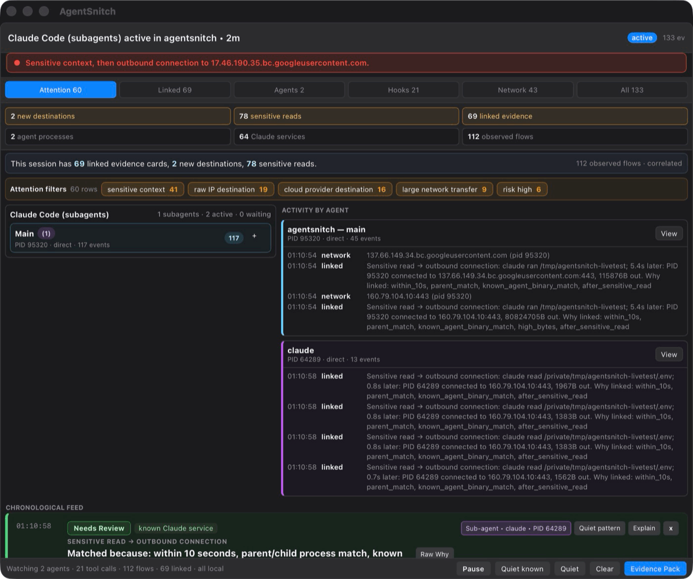
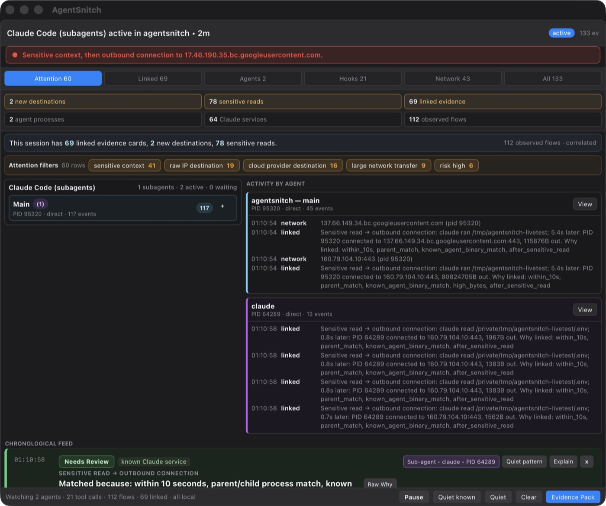
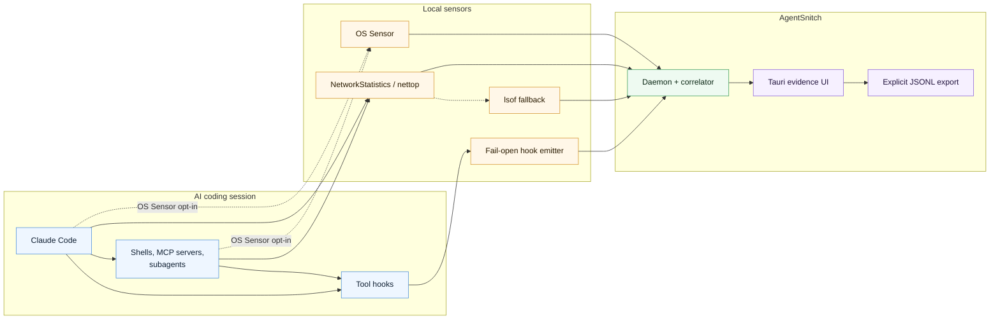

# AgentSnitch

[](https://github.com/somoore/agentsnitch/releases/tag/v0.1.0-pre-alpha.5)
[](https://github.com/somoore/agentsnitch/actions/workflows/supply-chain.yml)
[](https://github.com/somoore/agentsnitch/actions/workflows/release-macos.yml)
[](./LICENSE)

AgentSnitch gives developers local, explainable evidence when AI coding agents touch sensitive local context and then make outbound network connections.

It is a macOS visibility tool for Claude Code today, with a local daemon, fail-open hook emitter, Tauri UI, default unprivileged process/network observation, an opt-in OS Sensor mode for stronger OS-backed attribution, and an advanced opt-in HTTPS Inspect Mode for managed agent proxy traffic.

## 60-Second Proof Loop



After installing AgentSnitch and enabling Claude Code hooks from Settings, restart Claude Code and ask it to run this safe demo:

```sh
mkdir -p /tmp/agentsnitch-proof
printf 'DEMO_TOKEN=example-value\n' > /tmp/agentsnitch-proof/.env
cat /tmp/agentsnitch-proof/.env
curl -k --max-time 2 --resolve example.invalid:443:93.184.216.34 https://example.invalid/ >/dev/null || true
```

The expected product loop is: Claude touches a `.env`-shaped file, a child process opens an external connection using the inert `example.invalid` hostname, and AgentSnitch shows why the local semantic event and observed network flow were linked.



## What Is AgentSnitch?

AgentSnitch correlates three local signals:

- **Agent intent:** Claude Code `PreToolUse` and `PostToolUse` hooks report what the agent is doing, including file reads, shell commands, MCP tool use, WebFetch, WebSearch, and subagent activity.
- **Network activity:** the daemon observes outbound connections from agent-like process trees using NetworkStatistics/`nettop` by default, with `lsof` fallback and optional OS Sensor telemetry for stronger OS-backed attribution.
- **Explainable evidence:** the daemon links semantic events to network flows by time, PID, ancestry, session, and destination intent, then shows the result in a compact local UI.

AgentSnitch is not a DLP product, not a SaaS telemetry collector, and not an enforcement gate. Hooks fail open, traffic is not blocked, and product evidence comes from real local sensors.

## Why Use AgentSnitch?

- See when an AI coding agent reads sensitive files or credential-looking output and then opens outbound connections.
- Separate raw network noise from linked evidence that explains what happened and why it was correlated.
- Understand Claude Code main-agent and subagent activity without replaying transcripts as fake runtime evidence.
- Keep session data local unless you explicitly export it.
- Validate agent behavior before deciding whether you need stronger sandboxing, policy, or isolation.

## Quick Start

Download the latest pre-alpha package from [AgentSnitch v0.1.0-pre-alpha.5](https://github.com/somoore/agentsnitch/releases/tag/v0.1.0-pre-alpha.5), then install the macOS `.pkg`. The package installs:

- `AgentSnitch.app`
- the local daemon and support tools
- a per-user LaunchAgent
- Claude Code hook tooling, installed only when enabled from Settings

For a source checkout:

```sh
make create
make doctor
```

`make create` builds the Go tools and Tauri app, installs `/Applications/AgentSnitch.app`, starts the user daemon, launches the app, and runs `doctor`. Claude Code hooks are not installed automatically; open Settings -> Hooks to install or update them explicitly.

Current Settings tabs are:

- **General:** interface mode.
- **Hooks:** Claude Code hook install/update/remove controls and the "keep hooks up to date" startup option.
- **Advanced:** OS Sensor mode, OS Sensor startup default, Reverse DNS / PTR labels, and PTR "Always On".
- **Developer:** HTTPS Inspect Mode, local CA/system trust actions, payload capture controls, and the hidden-by-default Debug button.

For development-only builds:

```sh
make build
make run-daemon
```

Release builds are created from annotated GPG-signed tags. See
[Release Process](docs/release.md) for the release key setup, GitHub
`release-signing` environment secret, and tag-cutting flow.

## How It Works



## Privacy And Safety

- Local-only by design.
- No AgentSnitch phone-home telemetry.
- No SaaS backend.
- No AgentSnitch telemetry or SaaS egress. Reverse-DNS destination labeling is disabled by default; enable **Reverse DNS / PTR labels** in Settings only when you need destination-name debugging. PTR lookup asks the local resolver for labels and is outbound DNS by nature. The **Always On** checkbox persists the underlying `AGENTSNITCH_ENABLE_REVERSE_DNS=1` daemon switch for app exits, daemon restarts, and reboots.
- No network blocking in the current pre-alpha.
- Hooks fail open so agent workflows continue if AgentSnitch is not running.
- OS Sensor mode is disabled by default. User Visibility mode remains the startup default unless you explicitly enable OS Sensor mode as the default in Settings.
- HTTPS Inspect Mode is disabled by default and lives under Settings -> Developer. It only applies to managed traffic routed through AgentSnitch's local proxy; `agentsnitchctl inspect run -- ...` scopes the proxy credentials to that managed run. It does not inspect browser traffic, all system traffic, pinned TLS clients, or traffic that bypasses the managed proxy. Installing or removing the AgentSnitch CA from macOS System trust is an explicit administrator-approved action.
- The footer Debug button is disabled by default. Enable it from Settings -> Developer only when you need an on-demand local diagnostic snapshot.
- AgentSnitch resists accidental or fake product ingestion paths, but it is not tamper-proof against the same local user or a process running with that user's privileges.

## Documentation

- [getting started](./docs/getting-started.md)
- [architecture](./architecture.md)
- [subagent detection](./docs/subagent-detection-phase1.md)
- [network extension integration](./extension/integration.md)
- [advanced HTTPS inspect mode](./docs/advanced-https-inspect-mode.md)

## License

MIT
