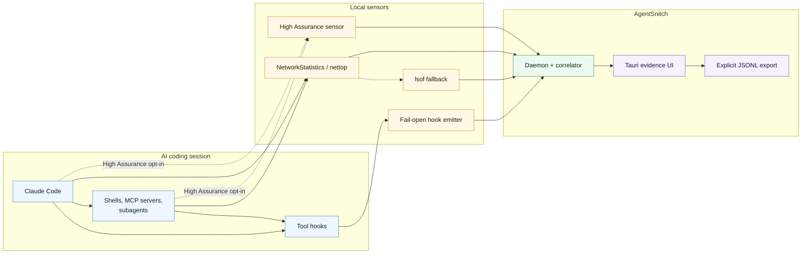

# AgentSnitch

[](https://github.com/somoore/agentsnitch/releases/tag/v0.1.0-pre-alpha.4)
[](https://github.com/somoore/agentsnitch/actions/workflows/supply-chain.yml)
[](https://github.com/somoore/agentsnitch/actions/workflows/release-macos.yml)
[](./LICENSE)

AgentSnitch gives developers local, explainable evidence when AI coding agents touch sensitive local context and then make outbound network connections.

It is a macOS visibility tool for Claude Code today, with a local daemon, fail-open hook emitter, Tauri UI, default unprivileged process/network observation, and an opt-in High Assurance mode for stronger OS-backed attribution.

## What Is AgentSnitch?

AgentSnitch correlates three local signals:

- **Agent intent:** Claude Code `PreToolUse` and `PostToolUse` hooks report what the agent is doing, including file reads, shell commands, MCP tool use, WebFetch, WebSearch, and subagent activity.
- **Network activity:** the daemon observes outbound connections from agent-like process trees using NetworkStatistics/`nettop` by default, with `lsof` fallback and optional High Assurance OS-backed telemetry.
- **Explainable evidence:** the daemon links semantic events to network flows by time, PID, ancestry, session, and destination intent, then shows the result in a compact local UI.

AgentSnitch is not a DLP product, not a SaaS telemetry collector, and not an enforcement gate. Hooks fail open, traffic is not blocked, and product evidence comes from real local sensors.

## Why Use AgentSnitch?

- See when an AI coding agent reads sensitive files or credential-looking output and then opens outbound connections.
- Separate raw network noise from linked evidence that explains what happened and why it was correlated.
- Understand Claude Code main-agent and subagent activity without replaying transcripts as fake runtime evidence.
- Keep session data local unless you explicitly export it.
- Validate agent behavior before deciding whether you need stronger sandboxing, policy, or isolation.

## Quick Start

Download the latest pre-alpha package from [AgentSnitch v0.1.0-pre-alpha.4](https://github.com/somoore/agentsnitch/releases/tag/v0.1.0-pre-alpha.4), then install the macOS `.pkg`. The package installs:

- `AgentSnitch.app`
- the local daemon and support tools
- a per-user LaunchAgent
- Claude Code hook registration for the console user

For a source checkout:

```sh
make create
make doctor
```

`make create` builds the Go tools and Tauri app, installs `/Applications/AgentSnitch.app`, registers Claude Code hooks, starts the user daemon, launches the app, and runs `doctor`.

For development-only builds:

```sh
make build
make run-daemon
```

## How It Works



## Privacy And Safety

- Local-only by design.
- No AgentSnitch phone-home telemetry.
- No SaaS backend.
- No network blocking in the current pre-alpha.
- Hooks fail open so agent workflows continue if AgentSnitch is not running.
- High Assurance is disabled by default. User Visibility mode remains the startup default unless you explicitly enable High Assurance as the default in Settings.

## Documentation

- [getting started](./docs/getting-started.md)
- [architecture](./architecture.md)
- [product requirements](./prd.md)
- [contributing](./contributing.md)
- [subagent detection](./docs/subagent-detection-phase1.md)
- [network extension integration](./extension/integration.md)

## License

MIT
